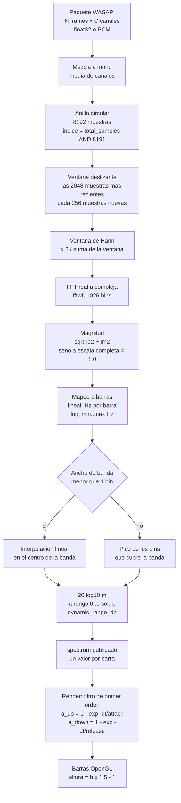
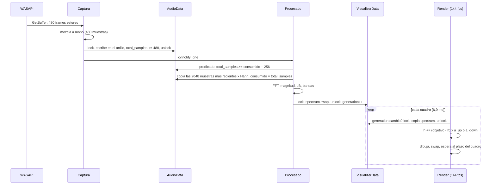
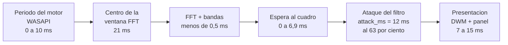

# Audio Visualizer

Visualizador de espectro en tiempo real para Windows. Captura el audio que el sistema está reproduciendo (loopback WASAPI), calcula su espectro con FFTW y lo dibuja como barras con OpenGL, sincronizado con la tasa de refresco del monitor.

- Lenguaje: C++17
- Plataforma: Windows 10/11, x64
- IDE: Visual Studio 2026 (toolset v145)
- Sin dependencias externas que instalar: todas las bibliotecas van dentro del repositorio

## Índice

1. [Compilar y ejecutar](#compilar-y-ejecutar)
2. [Estructura del repositorio](#estructura-del-repositorio)
3. [Arquitectura](#arquitectura)
4. [Pipeline de señal](#pipeline-de-señal)
5. [Sincronización entre hilos](#sincronización-entre-hilos)
6. [Latencia](#latencia)
7. [Configuración](#configuración)
8. [Métricas en el título de la ventana](#métricas-en-el-título-de-la-ventana)
9. [Dependencias de terceros](#dependencias-de-terceros)
10. [Solución de problemas](#solución-de-problemas)
11. [Decisiones de diseño](#decisiones-de-diseño)

## Compilar y ejecutar

Requisitos:

- Visual Studio 2026 con la carga de trabajo "Desarrollo para el escritorio con C++" (toolset v145).
- Windows SDK 10.x. El proyecto usa `WindowsTargetPlatformVersion` 10.0, que resuelve al SDK más reciente instalado.

Desde Visual Studio: abrir `audio-visualizer.sln`, elegir `Debug|x64` o `Release|x64` y pulsar F5.

Desde línea de comandos:

```powershell
& "C:\Program Files\Microsoft Visual Studio\18\Community\MSBuild\Current\Bin\MSBuild.exe" audio-visualizer.sln -p:Configuration=Release -p:Platform=x64
.\x64\Release\audio-visualizer.exe
```

El paso post-build copia a la carpeta de salida (`x64\Debug` o `x64\Release`) todo lo que el ejecutable necesita en tiempo de ejecución:

| Archivo | Origen |
|---|---|
| `libfftw3-3.dll`, `libfftw3f-3.dll` | `fftw-3.3.5-dll64\` |
| `glew32.dll` | `glew-2.1.0\bin\Release\x64\` |
| `glfw3.dll` | `glfw-3.4.bin.WIN64\lib-vc2022\` |
| `config.json` | raíz del proyecto |

Solo existen configuraciones x64. Las bibliotecas incluidas son de 64 bits y las configuraciones Win32 se eliminaron porque no podían compilar.

## Estructura del repositorio

```
audio-visualizer/
|-- audio-visualizer.sln            Solución (solo Debug|x64 y Release|x64)
|-- audio-visualizer.vcxproj        Proyecto. Rutas relativas a $(ProjectDir)
|-- config.json                     Configuración en tiempo de ejecución
|
|-- main.cpp                        Arranque, hilos y cierre ordenado
|-- common.h                        Constantes (FFT_SIZE, HOP_SIZE) y estructuras compartidas
|-- config.h / config.cpp           Estructura de configuración y carga desde JSON
|-- audio-capture.h / .cpp          Hilo de captura WASAPI loopback
|-- audio-processing.h / .cpp       Hilo de FFT y mapeo a barras
|-- renderer.h / .cpp               Bucle de render OpenGL y limitador de cuadros
|
|-- fftw-3.3.5-dll64/               FFTW 3.3.5 (DLL, cabecera y .lib de importación)
|-- glew-2.1.0/                     GLEW 2.1.0
|-- glfw-3.4.bin.WIN64/             GLFW 3.4, binarios oficiales Win64
`-- json-develop/                   nlohmann/json 3.12.0, solo include/ y licencia
```

Ignorado por Git: `.vs/`, `x64/`, `*.vcxproj.user` y `fftw-3.3.5-dll64/*.exp`.

## Arquitectura

Tres hilos con dos puntos de intercambio. El hilo principal hace de hilo de render.

```mermaid
flowchart LR
    subgraph Windows
        WASAPI[Motor de audio<br/>loopback del dispositivo<br/>de salida por defecto]
    end

    subgraph T1[Hilo de captura]
        CAP[AudioCaptureThread<br/>mezcla a mono<br/>convierte a float]
    end

    subgraph SD1[AudioData]
        RING[(ring: float x 8192<br/>total_samples<br/>sample_rate)]
    end

    subgraph T2[Hilo de procesado]
        FFT[AudioProcessingThread<br/>Hann + FFT r2c<br/>magnitud, dB, bandas]
    end

    subgraph SD2[VisualizerData]
        SPEC[(spectrum: float x barras<br/>generation<br/>atomic_num_bars)]
    end

    subgraph T0[Hilo principal]
        REN[RenderThread<br/>ataque / caída por dt<br/>OpenGL + limitador]
    end

    WASAPI -- paquetes de ~10 ms --> CAP
    CAP -- lock, escribe, notify --> RING
    RING -- wait, copia 2048 muestras --> FFT
    FFT -- lock, swap, generation++ --> SPEC
    SPEC -- copia si generation cambió --> REN
    REN -- atomic_num_bars = ancho en px --> SPEC
```



Responsabilidades por archivo:

| Archivo | Hace | No hace |
|---|---|---|
| `audio-capture.cpp` | Abre el loopback, detecta formato (float32, PCM 16/24/32), mezcla canales a mono, escribe en el anillo, reabre el dispositivo si cambia | Ningún análisis |
| `audio-processing.cpp` | Ventana deslizante, Hann, FFT, magnitud normalizada, dB, mapeo de bins a barras, publicación | Ningún dibujo ni temporización |
| `renderer.cpp` | Ventana GLFW, animación temporal de barras, dibujo, limitador de cuadros, métricas | Ningún acceso al audio crudo |
| `config.cpp` | Lee `config.json` con valores por defecto para cada clave ausente | Recarga en caliente |

## Pipeline de señal



Constantes en `common.h`:

| Constante | Valor | Efecto |
|---|---|---|
| `FFT_SIZE` | 2048 | Ventana de 42,7 ms a 48 kHz. Resolución de 23,4 Hz por bin. Más grande da mejor resolución en graves y más latencia |
| `HOP_SIZE` | 256 | Avance entre espectros. 5,3 ms a 48 kHz. El techo real lo pone el periodo de 10 ms del motor de Windows |
| `RING_SIZE` | 8192 | Cuatro ventanas de holgura. Potencia de dos para indexar con máscara |

La frecuencia de muestreo no está fija: se lee del formato de mezcla del dispositivo (habitualmente 48000 Hz) y el mapeo de bandas se recalcula si cambia.

## Sincronización entre hilos

| Dato | Estructura | Escribe | Lee | Protección |
|---|---|---|---|---|
| `ring`, `total_samples` | `AudioData` | Captura | Procesado | `AudioData::mtx` + `cv` con predicado |
| `sample_rate` | `AudioData` | Captura | Procesado, Render | `std::atomic<int>` |
| `spectrum` | `VisualizerData` | Procesado (swap) | Render (copia) | `VisualizerData::mtx` |
| `generation` | `VisualizerData` | Procesado | Render | `std::atomic<uint64_t>` |
| `atomic_num_bars` | `VisualizerData` | Render (callback de tamaño) | Procesado, Render | `std::atomic<int>` |
| `should_terminate` | `VisualizerData` | Hilo principal | Todos | `std::atomic<bool>`, se pone a true con `AudioData::mtx` tomado |

Ciclo típico con un paquete de 480 frames (10 ms a 48 kHz):



Puntos que importan:

- El procesado siempre toma las muestras más recientes. Si llegan varios saltos de golpe, salta al final en lugar de encolar espectros atrasados.
- El espectro se publica por `swap` de vectores. El render nunca lee un búfer que se esté escribiendo.
- Todas las esperas usan `condition_variable::wait` con predicado, así que no hay notificaciones perdidas ni despertares espurios que produzcan trabajo vacío.
- El cierre pone `should_terminate` con el mutex tomado y luego notifica. El hilo de procesado no puede quedarse dormido entre comprobar el predicado y esperar.
- Los paquetes marcados como silencio escriben ceros. Así las barras caen cuando el audio para, en lugar de congelarse en el último espectro.

## Latencia

Del sonido a la pantalla, en el peor caso, con valores por defecto a 48 kHz y 144 Hz:



Total aproximado: 45 a 65 ms hasta que la barra alcanza dos tercios de su valor. Lo que se puede tocar:

- `attack_ms` más bajo acelera la subida, pero amplifica el parpadeo entre espectros consecutivos.
- `FFT_SIZE` 1024 quita 10 ms de ventana a cambio de bins de 47 Hz, lo que empeora la separación de graves.
- El periodo del motor de Windows (10 ms) y la presentación no dependen de la aplicación.

## Configuración

`config.json` se lee una vez al arrancar desde el directorio de trabajo. En Visual Studio el depurador arranca en la carpeta de salida, donde el post-build lo copia. Cualquier clave ausente toma su valor por defecto y un tipo incorrecto se avisa por `cerr` sin abortar.

```json
{
  "estilos": {
    "attack_ms": 12,
    "release_ms": 160,
    "amplitude_factor": 1.0,
    "dynamic_range_db": 60,
    "base_color_rgb": [ 0.65, 0.15, 0.15 ],
    "bin_grouping_factor": 10.0,
    "frequency_scale": "linear",
    "min_frequency": 30,
    "max_frequency": 16000,
    "vsync": true,
    "max_fps": 0
  }
}
```

| Clave | Tipo | Defecto | Significado |
|---|---|---|---|
| `attack_ms` | número | 12 | Constante de tiempo de subida de las barras, en ms. Independiente de los fps |
| `release_ms` | número | 160 | Constante de tiempo de caída, en ms. Bajo = nervioso, alto = suave |
| `amplitude_factor` | número | 1.0 | Ganancia visual sobre el espectro ya normalizado a 0..1 |
| `dynamic_range_db` | número | 60 | Rango vertical en dB. 0 dBFS arriba, `-dynamic_range_db` abajo |
| `base_color_rgb` | [r, g, b] | [0.65, 0.15, 0.15] | Color base en 0..1. La altura desplaza cada componente en más o menos 0.5 |
| `bin_grouping_factor` | número | 10.0 | Hz por barra con `frequency_scale` = `linear` |
| `frequency_scale` | `"linear"` o `"log"` | `"linear"` | Reparto del eje horizontal. `log` reparte por octavas, como los visualizadores musicales habituales |
| `min_frequency`, `max_frequency` | número | 30, 16000 | Límites del eje con `frequency_scale` = `log` |
| `vsync` | booleano | true | Pide un cuadro por refresco al driver. Si el driver lo ignora, el limitador entra solo |
| `max_fps` | entero | 0 | Límite del limitador. 0 = tasa de refresco del monitor donde está la ventana |

El número de barras no se configura: es el ancho del framebuffer en píxeles y cambia al redimensionar la ventana.

## Métricas en el título de la ventana

El título se actualiza una vez por segundo:

```
Audio Visualizer  |  144 fps (monitor 144 Hz, limitador)  |  100 espectros/s  |  audio 48000 Hz  |  1024 barras
```

| Campo | Qué indica | Valor esperado |
|---|---|---|
| `fps` | Cuadros dibujados en el último segundo | Igual a la tasa del monitor |
| `monitor N Hz` | Tasa de refresco del monitor que contiene el centro de la ventana | La configurada en Windows |
| `vsync` / `limitador` | Quién marca el ritmo: el driver o el limitador interno | Cualquiera de los dos con fps correctos |
| `espectros/s` | Espectros publicados por el hilo de procesado | Alrededor de 100, por el periodo de 10 ms del motor de audio |
| `audio N Hz` | Frecuencia de muestreo real del dispositivo | 44100 o 48000 según el dispositivo |
| `barras` | Barras dibujadas | Ancho de la ventana en píxeles |

Si `fps` marca miles y no aparece `limitador`, el driver ignora la sincronía vertical y el limitador aún no se ha activado. Tarda un segundo en detectarlo.

## Dependencias de terceros

Todas están versionadas dentro del repositorio para que clonar y compilar funcione sin pasos previos.

| Biblioteca | Versión | Carpeta | Uso | Licencia | Enlace |
|---|---|---|---|---|---|
| FFTW | 3.3.5 | `fftw-3.3.5-dll64/` | FFT real a compleja en precisión simple (`fftwf_*`) | GPL v2 o posterior (`COPYING`) | Dinámico, `libfftw3f-3.dll` |
| GLFW | 3.4 | `glfw-3.4.bin.WIN64/` | Ventana, contexto OpenGL, eventos, temporizador, monitores | zlib/libpng (`LICENSE.md`) | Dinámico, `glfw3dll.lib` + `glfw3.dll` |
| GLEW | 2.1.0 | `glew-2.1.0/` | Enlazado por el proyecto. El código actual usa solo OpenGL 1.x y no llama a GLEW | BSD modificada / MIT (`LICENSE.txt`) | Dinámico, `glew32.lib` |
| nlohmann/json | 3.12.0 | `json-develop/` | Lectura de `config.json` | MIT (`LICENSE.MIT`) | Solo cabeceras |

Notas:

- FFTW es GPL. Distribuir el ejecutable obliga a distribuirlo bajo GPL o a adquirir la licencia comercial de FFTW.
- El paquete oficial de FFTW para Windows no trae `.lib` de importación. Los tres `.lib` del repositorio se generaron con `lib.exe /def:libfftw3X-3.def /machine:x64`. Los `.exp` intermedios están ignorados.
- La carpeta `json-develop/` conserva el nombre histórico del proyecto, pero contiene la release 3.12.0 recortada a `include/`, `LICENSE.MIT` y `README.md`. El resto (tests, docs, herramientas) se eliminó porque no interviene en la compilación y sus dependencias Python generaban alertas de Dependabot.
- GLFW se enlaza como DLL a propósito. La `glfw3.lib` estática está compilada con el CRT de Release y provocaba el aviso LNK4098 en Debug.

## Solución de problemas

| Síntoma | Causa | Solución |
|---|---|---|
| Aviso "The build tools for v143 cannot be found" | El proyecto pedía el toolset de VS 2022 | Ya está en v145. Si aparece en otra máquina con VS 2022, retargetear a v143 desde el menú Proyecto |
| `Cannot open include file: 'fftw3.h'` u otro de terceros | Rutas de include rotas | Las rutas son `$(ProjectDir)...`. Comprobar que las cuatro carpetas de bibliotecas están junto al `.vcxproj` |
| `Config: no se pudo abrir config.json` en la consola | Directorio de trabajo distinto al de `config.json` | Ejecutar desde `x64\Release` o desde la raíz. La consola está oculta por `FreeConsole()`; comentar esa línea en `main.cpp` para ver mensajes |
| Barras planas con audio sonando | El dispositivo de salida por defecto no es el que suena | El loopback sigue al dispositivo por defecto de Windows. Cambiarlo en Configuración de sonido. La aplicación reabre el dispositivo sola |
| El título marca miles de fps | El driver gráfico ignora `glfwSwapInterval(1)` | Esperar un segundo: el limitador se activa y clava los fps al monitor. Para forzar un valor, `max_fps` |
| El título marca 60 fps en un monitor de 144 Hz | Windows tiene el monitor a 60 Hz o la ventana está en otro monitor | Configuración de pantalla, frecuencia de actualización avanzada. El campo `monitor N Hz` muestra lo que detecta la aplicación |
| Barras que tardan en caer o suben tarde | `release_ms` o `attack_ms` altos | Ajustar en `config.json`. Valores en milisegundos, independientes de los fps |
| `LNK1104: cannot open file audio-visualizer.exe` | El ejecutable sigue en uso o el antivirus lo está analizando | Cerrar la instancia y volver a compilar |

## Decisiones de diseño

- **Bibliotecas dentro del repositorio.** Se descartó vcpkg para que un clon compile sin instalar nada. El coste son unos 35 MB de binarios versionados.
- **Solo x64.** Las bibliotecas incluidas son de 64 bits. Mantener configuraciones Win32 que no compilan solo confunde.
- **Ventana deslizante con solapamiento.** Llenar y vaciar un búfer de 4096 muestras producía un espectro cada 85 ms. Con un anillo y un salto de 256 muestras, el límite pasa a ser el periodo del motor de audio.
- **Animación en tiempo, no en cuadros.** Un factor de suavizado por cuadro cambia de comportamiento con los fps. Con constantes en milisegundos y el `dt` real, el resultado es el mismo a 60, 144 o 240 Hz.
- **Limitador adaptativo en lugar de confiar en vsync.** En la máquina de desarrollo el driver ignoraba la sincronía vertical y el bucle corría a 7000 fps consumiendo un núcleo. El limitador se activa solo cuando detecta ese caso, para no interferir cuando vsync sí funciona.
- **Mezcla a mono.** El espectro es de la suma de canales. Una versión estéreo duplicaría FFT y barras y no aporta a un visualizador de una sola fila.
- **Interpolación de bandas estrechas.** Con 10 Hz por barra y 23 Hz por bin, muchas barras no contienen ningún bin. Interpolar evita barras permanentemente negras sin subir el tamaño de la FFT.
- **Render en el hilo principal.** GLFW lo requiere en otras plataformas y en Windows simplifica el cierre: cuando la ventana se cierra, `main` señala a los demás hilos y espera.
