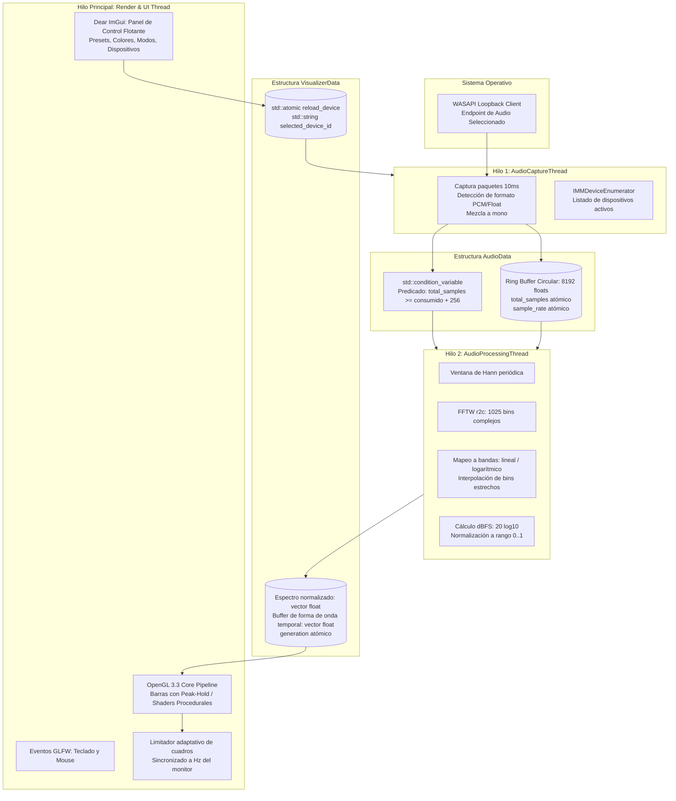

# Especificación Técnica (Tech Spec) - Audio Visualizer 2.0

## 1. Stack Tecnológico y Matriz "Build vs. Adopt"

| Dominio | Tecnología / Estándar | Justificación (Build vs. Adopt) |
|---|---|---|
| **Lenguaje Base** | C++17 | Estándar moderno, concurrencia nativa (`std::thread`, `std::atomic`, `std::mutex`), compatibilidad con toolset v143/v145 de MSVC y compiladores GCC/Clang. |
| **Captura de Audio** | Windows WASAPI Loopback (COM) | **Construir lógica propia sobre API nativa**: Máximo rendimiento y mínima latencia en Windows. No requiere drivers virtuales de terceros. |
| **Análisis Espectral** | FFTW 3.3.5 (Float / `fftwf_*`) | **Adoptar**: La biblioteca más rápida del mundo para FFT en CPU con vectorización AVX/SSE. |
| **Ventana y Contexto** | GLFW 3.4 | **Adoptar**: Ligero, maneja DPI, eventos de ventana, multimonitor e intervalos de vsync fiables. |
| **Carga de Extensiones GL**| GLEW 2.1.0 | **Adoptar**: Ya integrado en el repositorio. Carga transparente de símbolos OpenGL 3.3+. |
| **Interfaz de Usuario (GUI)**| Dear ImGui (v1.90+ Docking/Standard) | **Adoptar**: Estándar de facto absoluto en herramientas interactivas C++. Cero dependencias pesadas, renderizado inmediato sobre el contexto OpenGL existente. |
| **Serialización de Config** | nlohmann/json 3.12.0 | **Adoptar**: Header-only, sintaxis intuitiva y tolerante a claves faltantes. |
| **Build System** | CMake 3.20+ | **Adoptar**: Estándar universal de construcción multiplataforma. Reemplaza la rigidez de `.sln`/`.vcxproj`. |

---

## 2. Arquitectura de Hilos y Flujo de Datos

Se mantiene el modelo de 3 hilos concurrentes de alto rendimiento desacoplados mediante búferes circulares y sincronización con predicados de condición:



---

## 3. Pipeline de Renderizado Modern OpenGL 3.3+

### 3.1 Inicialización de Contexto Core
```cpp
glfwWindowHint(GLFW_CONTEXT_VERSION_MAJOR, 3);
glfwWindowHint(GLFW_CONTEXT_VERSION_MINOR, 3);
glfwWindowHint(GLFW_OPENGL_PROFILE, GLFW_OPENGL_CORE_PROFILE);
glfwWindowHint(GLFW_OPENGL_FORWARD_COMPAT, GL_TRUE);
```
Tras la creación de ventana GLFW, se inicializa GLEW con `glewExperimental = GL_TRUE; glewInit();`.

### 3.2 Modos de Visualización Implementados

1. **Modo 1: Barras con Peak-Hold (VBO + Shaders)**:
   - Se emplea un VBO con un rectángulo unitario básico y un VBO con atributos instanciados (posición X, ancho, altura interpolada, altura de pico).
   - El Vertex Shader posiciona cada barra y su correspondiente marcador de pico horizontal.
   - El Fragment Shader aplica un degradado suave basado en la altura y un brillo especial para el indicador de pico.
   - La física del *Peak-Hold* almacena un valor de retardo (`hold_time_ms`) y una velocidad de caída por gravedad (`peak_decay_rate`).

2. **Modo 2: Radial / Circular (Procedural Quad + Fragment Shader)**:
   - Se dibuja un Quad de pantalla completa (-1..1).
   - El espectro se sube a una textura 1D (`GL_R32F`).
   - El Fragment Shader calcula coordenadas polares `(r, theta)` desde el centro de la pantalla, muestrea la textura 1D y dibuja un anillo de frecuencias reactivo con simetría circular o espiral.

3. **Modo 3: Osciloscopio / Waveform (Líneas suavizadas)**:
   - Muestra las muestras crudas en el dominio del tiempo desde el anillo de captura.
   - Renderizado con Shader de línea con antialiasing o textura 1D muestreada en pantalla completa.

4. **Modo 4: Espectrograma Cascada 2D (Waterfall)**:
   - Textura 2D flotante de tamaño `(num_barras, 256 historial)`.
   - Cada nuevo espectro desplaza o escribe en una fila circular mediante `glTexSubImage2D`.
   - Fragment shader mapea la amplitud a un mapa de calor térmico (*Inferno* o *Cyberpunk*).

---

## 4. Integración de Dear ImGui

- **Backends**: `imgui_impl_glfw.cpp` y `imgui_impl_opengl3.cpp` (con `#version 330 core`).
- **Ciclo de Cuadro**:
  1. `ImGui_ImplOpenGL3_NewFrame();`
  2. `ImGui_ImplGlfw_NewFrame();`
  3. `ImGui::NewFrame();`
  4. Si `show_hud == true`, renderizar ventana `ImGui::Begin("Audio Visualizer Settings", ...)` con sliders y combos.
  5. `ImGui::Render();`
  6. `ImGui_ImplOpenGL3_RenderDrawData(ImGui::GetDrawData());`
- **Control de Teclado**: La tecla `H` o `Tab` alterna `show_hud = !show_hud`. Cuando está oculto, ImGui no captura eventos del ratón.

---

## 5. Enumeración y Gestión de Dispositivos WASAPI

### 5.1 Estructura de Dispositivo
```cpp
struct AudioDeviceInfo {
    std::wstring id;
    std::string name;
    bool is_default;
};
```

### 5.2 Algoritmo de Enumeración
1. Instanciar `IMMDeviceEnumerator`.
2. Llamar a `EnumAudioEndpoints(eRender, DEVICE_STATE_ACTIVE, &pCollection)`.
3. Iterar cada `IMMDevice`, abrir su `IPropertyStore` y leer `PKEY_Device_FriendlyName`.
4. Obtener su ID único con `pDevice->GetId(&pStrId)`.
5. Si el usuario selecciona un nuevo dispositivo en la GUI:
   - Se escribe el `selected_device_id` en una variable protegida.
   - Se activa la bandera atómica `reload_device = true`.
   - El bucle de `AudioCaptureThread` detecta la bandera, libera los objetos COM actuales y reabre el nuevo endpoint sin reiniciar la aplicación ni el renderizador.

---

## 6. Arquitectura del Build System (CMakeLists.txt)

Estructura diseñada para funcionar inmediatamente tras clonar el repositorio:

- **Detección de librerías locales**:
  - `GLFW`: Rutas a `glfw-3.4.bin.WIN64/include` y `glfw-3.4.bin.WIN64/lib-vc2022/glfw3dll.lib`.
  - `GLEW`: Rutas a `glew-2.1.0/include` y `glew-2.1.0/lib/Release/x64/glew32.lib`.
  - `FFTW`: Rutas a `fftw-3.3.5-dll64` y `libfftw3f-3.lib`.
  - `nlohmann_json`: Ruta a `json-develop/include`.
- **Dear ImGui**: Vendorizado en `imgui-1.91.5/` (núcleo `imgui.cpp`, `imgui_draw.cpp`, `imgui_tables.cpp`, `imgui_widgets.cpp` y backends `imgui_impl_glfw.cpp`, `imgui_impl_opengl3.cpp`) y compilado como biblioteca estática `imgui_lib`. Se descartó `FetchContent` porque exige red y git en tiempo de configuración y el clon fallaba de forma intermitente. La solución `.sln` compila los mismos archivos directamente.
- **Comandos Post-Build**: Copia automática de `libfftw3f-3.dll`, `glew32.dll`, `glfw3.dll`, `config.json` y la carpeta `shaders/` al directorio del binario objetivo (`$<TARGET_FILE_DIR:audio-visualizer>`).
