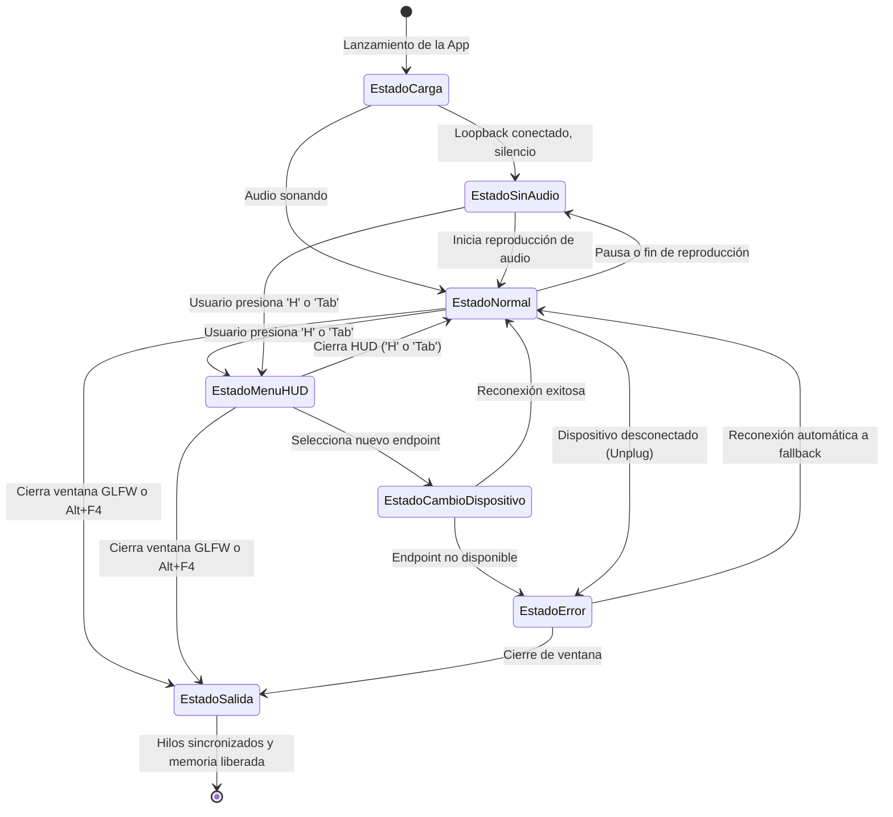

# Matriz de UX Flows y 7 Estados del Sistema - Audio Visualizer 2.0

Para garantizar una experiencia visual y de control impecable, el sistema contempla formalmente los 7 estados de ejecución y las transiciones del usuario:

---

## Detalle de los 7 Estados del Sistema

### 1. Estado de Carga (Boot / Initializing)
- **Comportamiento**:
  - Lee `config.json` y valida integridad de campos.
  - Inicializa contexto GLFW 3.3 Core Profile y GLEW.
  - Compila shaders GLSL y crea VBO/VAO/Texturas iniciales.
  - Configura contexto de Dear ImGui con tema oscuro estilizado.
  - Lanza hilos de captura WASAPI y procesamiento FFT.
- **Feedback Visual**: Ventana se abre en negro con título "Audio Visualizer - Inicializando...".
- **Duración**: Menor a 250 milisegundos.

### 2. Estado Sin Audio / Silencio Activo (Idle / Silence)
- **Comportamiento**:
  - WASAPI entrega paquetes con bandera `AUDCLNT_BUFFERFLAGS_SILENT` o ceros.
  - El filtro temporal decae suavemente todas las barras hacia cero según `release_ms`.
  - Los marcadores de pico (*Peak-Hold*) caen a su posición base.
- **Feedback Visual**: Línea base sutil, pantalla limpia, sin oscilaciones fantasma ni congelamiento. Título muestra métricas activas (fps, espectros/s, 0 barras activas).

### 3. Estado Normal / Reproduciendo Audio (Visualizing)
- **Comportamiento**:
  - Hilo de captura llena anillo circular; hilo FFT procesa ventanas de Hann y publica espectros; hilo de render dibuja a la tasa de refresco del monitor (60, 144 o 240 Hz).
  - El HUD de ImGui permanece oculto por defecto para ofrecer una experiencia inmersiva limpia.
- **Atajos de Teclado Rápidos**:
  - Tecla `1`: Modo Barras con Peak-Hold.
  - Tecla `2`: Modo Radial / Circular.
  - Tecla `3`: Modo Osciloscopio (Waveform).
  - Tecla `4`: Modo Espectrograma Cascada (Waterfall).
  - Tecla `H` o `Tab`: Alternar visibilidad del HUD.
  - Tecla `F11`: Pantalla completa / Modo ventana.

### 4. Estado de Interacción HUD (Configuring)
- **Comportamiento**:
  - Se dibuja una ventana flotante translúcida de Dear ImGui en la esquina superior izquierda.
  - La ventana no bloquea la animación de fondo; el visualizador sigue respondiendo a la música en tiempo real.
- **Controles Disponibles**:
  - **Selector de Modo**: Botones radiales para los 4 modos.
  - **Filtros Temporales**: Sliders para `attack_ms` (1 a 100 ms) y `release_ms` (10 a 500 ms).
  - **Escala de Frecuencia**: Radio buttons para `Linear` vs `Logarithmic`, con límites `min_freq` y `max_freq`.
  - **Rango Dinámico y Ganancia**: Sliders para `dynamic_range_db` (20 a 100 dB) y `amplitude_factor` (0.1x a 3.0x).
  - **Color Picker**: Selector de color base RGB, color de pico y fondo.
  - **Selector de Audio**: ComboBox con lista de endpoints WASAPI detectados.
  - **Acciones**: Botón "Guardar en config.json", botón "Restaurar por defecto".

### 5. Estado de Cambio de Dispositivo (Device Switching)
- **Comportamiento**:
  - Al cambiar de dispositivo en el ComboBox, el hilo de captura recibe la señal `reload_device`.
  - Libera `IAudioCaptureClient` y `IAudioClient` anteriores sin bloquear el hilo de render.
  - Abre el nuevo endpoint, lee su formato de mezcla nativo y actualiza la frecuencia de muestreo atómicamente.
- **Feedback Visual**: Transición suave de 1-2 cuadros. Si la frecuencia de muestreo cambia (ej. 44.1 kHz -> 48 kHz), el hilo FFT recalcula las bandas en el siguiente ciclo sin artefactos.

### 6. Estado de Error / Dispositivo Desconectado (Device Invalidation / Fallback)
- **Comportamiento**:
  - Si un auricular USB o interfaz se desconecta, WASAPI reporta `AUDCLNT_E_DEVICE_INVALIDATED`.
  - El sistema captura la excepción, registra el incidente y conmuta automáticamente al dispositivo de salida por defecto del sistema (`eConsole`).
  - Si no hay ningún dispositivo disponible, entra en modo espera activa (100 ms) hasta que Windows registre un nuevo dispositivo de salida.
- **Feedback Visual**: Mensaje toast discreto en el HUD notificando "Dispositivo desconectado. Conmutando a predeterminado."

### 7. Estado de Salida / Cierre Limpio (Graceful Shutdown)
- **Comportamiento**:
  - El usuario cierra la ventana (icono de cerrar, Escape o Alt+F4).
  - `main` toma el mutex de `AudioData`, cambia `should_terminate = true` y lanza `cv.notify_all()`.
  - Hilo de captura sale del bucle y libera interfaces COM.
  - Hilo de procesamiento sale de `cv.wait()` y libera planes de FFTW (`fftwf_destroy_plan`).
  - Hilo de render destruye shaders, VBOs, contexto ImGui (`ImGui_ImplOpenGL3_Shutdown()`) y termina GLFW.
  - Ambos hilos secundarios se unen (`join()`).
- **Garantía**: Cero memory leaks, cero cuelgues de hilos zombis y cero bloqueos de procesos en el Administrador de Tareas.
