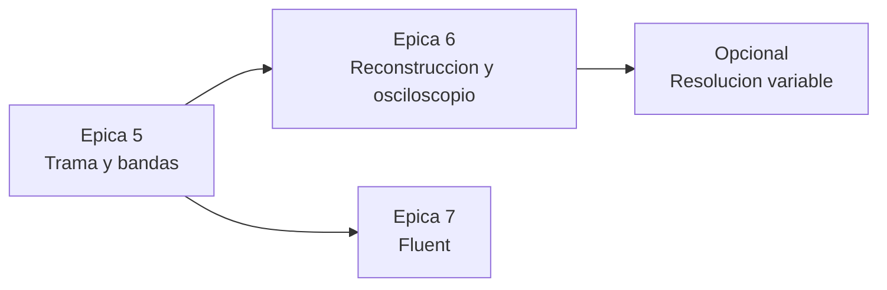

# Plan de Trabajo Ágil, Kanban y Criterios BDD - Audio Visualizer 2.0

> **Estado:** Mixto. Las épicas 1 a 4 están completadas y verificadas en la 2.0. Las épicas 5 a 7 son la propuesta para la 3.0.  
> **Alcance:** Definición de hecho y de preparado, épicas, historias y criterios de aceptación en formato Given-When-Then.  
> **Documentos relacionados:** [01_prd_lean.md](01_prd_lean.md), [11_analysis_frame_architecture.md](11_analysis_frame_architecture.md), [12_fluent_design_ui.md](12_fluent_design_ui.md)  
> **Convención:** este documento distingue entre lo *implementado* (verificable en el código de `master`) y lo *propuesto* (diseño para la versión 3.0). Toda cifra cuantitativa se deriva o se referencia; no hay estimaciones sin base.

## 1. Definición de Hecho (Definition of Done - DoD)
Una tarea o historia de usuario se considera terminada únicamente si:
1. **Compilación Limpia**: Compila en Debug y Release en x64 sin advertencias ni errores (`/W3` o superior sin avisos).
2. **Criterios BDD Verificados**: Los escenarios *Given-When-Then* asociados se ejecutan y superan satisfactoriamente.
3. **Métricas de Rendimiento**: Mantiene la tasa de refresco nativa (144+ FPS o vsync) sin caídas de frames ni fugas de memoria.
4. **Documentación Sincronizada**: Código debidamente comentado y `README.md` actualizado si cambian comandos de compilación o configuraciones.
5. **Documentación Formal**: Los documentos de `docs/` afectados declaran su estado en la cabecera, no contienen emojis, y toda cifra cuantitativa nueva se deriva o se referencia.
6. **Verificación Reproducible**: Cuando el criterio es numérico (error de reconstrucción, contraste, latencia), el procedimiento de medida queda descrito en la historia.

---

## 2. Definición de Preparado (Definition of Ready - DoR)
El sprint de desarrollo queda listo para comenzar cuando:
- [x] PRD Lean revisado y aprobado por el usuario.
- [x] Tech Spec con arquitectura de hilos, shaders e interfaces COM definida.
- [x] UX Flows y 7 estados del sistema especificados.
- [x] Historias de usuario BDD estructuradas con alcance acotado.

---

## 3. Épicas y Tablero Kanban BDD

### Épica 1: Build System Universal con CMake (Fase 1)
**Objetivo**: Permitir compilar el proyecto de forma independiente al IDE mediante CMake 3.20+, gestionando dependencias locales e integrando Dear ImGui.

#### Historia 1.1: Configuración de CMakeLists.txt con dependencias locales
- **Como**: Desarrollador C++.
- **Quiero**: Un archivo `CMakeLists.txt` que detecte GLFW, GLEW, FFTW y nlohmann/json desde las carpetas locales del repositorio.
- **Para**: Compilar el proyecto con cualquier generador (Visual Studio, Ninja, Clang) sin instalar dependencias globales.
- **Criterios BDD**:
  - **Scenario**: Generación y compilación con CMake
    - **Given** una copia limpia del repositorio en Windows
    - **When** se ejecuta `cmake -B build -S .` y `cmake --build build --config Release`
    - **Then** el proceso termina exitosamente con código 0 y genera el ejecutable `audio-visualizer.exe`
  - **Scenario**: Copia automática de binarios en post-build
    - **Given** la compilación finalizada del ejecutable
    - **When** se examina la carpeta de salida (`build/Release` o `build`)
    - **Then** las DLLs `libfftw3f-3.dll`, `glew32.dll`, `glfw3.dll` y `config.json` se encuentran presentes automáticamente.

#### Historia 1.2: Integración de Dear ImGui vía CMake
- **Como**: Desarrollador C++.
- **Quiero**: Descargar o compilar Dear ImGui (con backends GLFW y OpenGL3) como parte del proceso de CMake.
- **Para**: Disponer de la API de ImGui lista para ser consumida en el hilo de renderizado.
- **Criterios BDD**:
  - **Scenario**: Inclusión de cabeceras de ImGui
    - **Given** el proyecto configurado con CMake
    - **When** se incluye `#include <imgui.h>` y `#include <backends/imgui_impl_glfw.h>`
    - **Then** no hay errores de compilación ni símbolos indefinidos enlazando `imgui`.

---

### Épica 2: Modernización Gráfica OpenGL 3.3+ y Shaders (Fase 2)
**Objetivo**: Sustituir el renderizado inmediato OpenGL 1.1 por un pipeline de shaders GLSL modernos y renderizado híbrido.

#### Historia 2.1: Contexto Core Profile y Shader Loader
- **Como**: Usuario de la aplicación.
- **Quiero**: Que la ventana utilice OpenGL 3.3 Core Profile con shaders compilados en GPU.
- **Para**: Aprovechar la aceleración de hardware moderna y eliminar llamadas obsoletas.
- **Criterios BDD**:
  - **Scenario**: Inicialización exitosa de OpenGL 3.3
    - **Given** la aplicación arrancando en Windows
    - **When** se crea la ventana GLFW con `GLFW_CONTEXT_VERSION_MAJOR 3` y `MINOR 3`
    - **Then** `glGetString(GL_VERSION)` retorna `>= 3.3.0` y no hay llamadas a `glBegin`/`glEnd`.

#### Historia 2.2: Modo Barras con Peak-Hold
- **Como**: Usuario melómano o streamer.
- **Quiero**: Ver las barras de frecuencia con pequeños marcadores de pico que sostienen el valor máximo y caen suavemente con gravedad.
- **Para**: Apreciar la dinámica y los transitorios de la música con mayor precisión visual.
- **Criterios BDD**:
  - **Scenario**: Respuesta de las marcas de pico
    - **Given** un golpe de bombo o transitorio fuerte de volumen
    - **When** la barra sube instantáneamente y luego desciende
    - **Then** el marcador de pico permanece en la posición más alta durante `hold_time_ms` y desciende progresivamente sin desaparecer de golpe.

#### Historia 2.3: Modos Visuales Procedurales (Radial, Waveform, Waterfall)
- **Como**: Usuario.
- **Quiero**: Poder alternar entre modo Barras, Modo Radial (circular), Osciloscopio y Espectrograma Cascada pulsando teclas numéricas (1, 2, 3, 4).
- **Para**: Disfrutar de diferentes estilos estéticos adaptados al tipo de música.
- **Criterios BDD**:
  - **Scenario**: Cambio instantáneo de modo visual
    - **Given** la aplicación ejecutándose en modo Barras
    - **When** el usuario presiona la tecla `2`
    - **Then** la pantalla pasa inmediatamente a visualizar el espectro radial circular sin parpadeos ni tirones en el audio.

---

### Épica 3: Panel de Control Interactivo con Dear ImGui (Fase 3)
**Objetivo**: Proporcionar una interfaz flotante translúcida para modificar todos los parámetros de renderizado en vivo y guardarlos en `config.json`.

#### Historia 3.1: Overlay Flotante y Control de Visibilidad
- **Como**: Usuario.
- **Quiero**: Abrir y ocultar el panel de control pulsando la tecla `H` o `Tab`.
- **Para**: Configurar los parámetros cuando lo necesite y mantener la pantalla despejada durante la visualización.
- **Criterios BDD**:
  - **Scenario**: Alternancia de visibilidad
    - **Given** la aplicación en ejecución con el HUD oculto
    - **When** el usuario pulsa la tecla `H`
    - **Then** aparece el panel de control translúcido con los controles interactivos
    - **When** vuelve a pulsar `H`
    - **Then** el panel se oculta y el ratón deja de interactuar con la UI.

#### Historia 3.2: Ajuste en Tiempo Real y Persistencia
- **Como**: Usuario.
- **Quiero**: Mover los controles deslizantes de ataque, caída, ganancia y colores y ver el efecto inmediato, con la opción de guardar en `config.json`.
- **Para**: Calibrar visualmente la respuesta sin tener que editar archivos de texto a mano.
- **Criterios BDD**:
  - **Scenario**: Modificación y persistencia
    - **Given** el HUD abierto
    - **When** el usuario cambia `release_ms` a 250 y hace clic en "Guardar Configuración"
    - **Then** el archivo `config.json` se actualiza en disco con el nuevo valor y la animación responde inmediatamente a los 250 ms.

---

### Épica 4: Selector y Gestor de Dispositivos WASAPI (Fase 4)
**Objetivo**: Permitir seleccionar cualquier interfaz o salida de audio activa desde la interfaz gráfica sin reiniciar el proceso.

#### Historia 4.1: Enumeración de Endpoints WASAPI
- **Como**: Usuario con múltiples tarjetas de sonido, auriculares USB o altavoces.
- **Quiero**: Que el combo de dispositivos en ImGui liste todos mis dispositivos de audio con sus nombres amigables.
- **Para**: Seleccionar exactamente qué fuente de audio deseo monitorizar.
- **Criterios BDD**:
  - **Scenario**: Listado de dispositivos
    - **Given** un sistema con altavoces Realtek y auriculares USB conectados
    - **When** se despliega el ComboBox de audio en el HUD
    - **Then** ambos dispositivos aparecen con sus nombres correspondientes y el actual está seleccionado.

#### Historia 4.2: Conmutación Atómica de Captura en Caliente
- **Como**: Usuario.
- **Quiero**: Cambiar de dispositivo en el menú desplegable y que el audio comience a capturarse desde la nueva salida de inmediato.
- **Para**: No tener que reiniciar la aplicación cuando cambio de auriculares a altavoces.
- **Criterios BDD**:
  - **Scenario**: Cambio de endpoint
    - **Given** el visualizador capturando del dispositivo por defecto
    - **When** el usuario selecciona los auriculares USB en el ComboBox
    - **Then** el hilo de captura cierra el cliente anterior, conecta el nuevo endpoint, ajusta la frecuencia de muestreo y reanuda la visualización en menos de 500 ms sin bloquear la interfaz.

---

### Épica 5: Trama de Análisis y Bandas Configurables (Fase 5, propuesta 3.0)
**Objetivo**: Sustituir el vector de alturas por una trama de análisis completa y permitir al usuario particionar el espectro en bandas nombradas con dinámica propia. Diseño en el documento 11, secciones 3 a 7.

#### Historia 5.1: `AnalysisFrame` y triple búfer (completada)

Verificación: MSBuild y CMake sin avisos; los cuatro modos equivalentes por captura de pantalla; hilo de análisis al 0,5 % de un núcleo medido con 100 tramas por segundo; el consumidor lee `sequence` estrictamente creciente por construcción del triple búfer.
- **Como**: Desarrollador de renderizadores.
- **Quiero**: Recibir por cuadro magnitud, fase, dB, RMS, pico y flujo espectral sin copias ni bloqueos.
- **Para**: Escribir modos nuevos sin tocar el análisis.
- **Criterios BDD**:
  - **Scenario**: Equivalencia visual con la 2.0
    - **Given** audio en reproducción y los cuatro modos de la 2.0 adaptados a la trama
    - **When** se capturan los cuatro modos antes y después del cambio
    - **Then** las capturas son visualmente equivalentes y el hilo de procesado no supera el 1 % de CPU.
  - **Scenario**: Ausencia de tramas parciales
    - **Given** el productor a 187 tramas por segundo y el consumidor a 144
    - **When** se instrumenta el consumidor para verificar el campo `sequence`
    - **Then** cada trama leída tiene `sequence` estrictamente creciente y nunca se observa una trama a medio escribir.

#### Historia 5.2: Definición de bandas y energía (completada)

Verificación: `tests/band_metrics_test.cpp` (objetivo `band_metrics_test` de CMake, `ctest --test-dir build -C Release`). Resultados en el documento 11, fase B. La tolerancia del pico se corrigió de 0,5 dB a la pérdida de festoneado de Hann (1,42 dB) y la fuga a la banda contigua se acota por el lóbulo principal (-31 dB), ambos derivados del documento 10.
- **Como**: Usuario.
- **Quiero**: Dividir el espectro en octavas, en partes iguales o con cortes manuales, con nombre y color por banda.
- **Para**: Ver la energía de cada rango por separado.
- **Criterios BDD**:
  - **Scenario**: Energía en la banda correcta
    - **Given** el preset de siete bandas y una senoidal de 100 Hz a -6 dBFS
    - **When** se leen `band_energy` y `band_peak_db`
    - **Then** la banda "Bajo" concentra más del 99 % de la energía, su pico está a -6 dB con error inferior a la pérdida de festoneado de Hann (1,42 dB), la banda contigua queda al menos 25 dB por debajo (lóbulo principal) y las demás al menos 40 dB.
  - **Scenario**: Parseval por bandas
    - **Given** cualquier señal
    - **When** se suman las energías de todas las bandas, incluida la banda implícita "resto"
    - **Then** el resultado iguala la energía total de la trama con error relativo menor que $10^{-4}$.
  - **Scenario**: Validación de cortes
    - **Given** el HUD en la pestaña de bandas
    - **When** el usuario intenta arrastrar un corte por encima del siguiente
    - **Then** el corte se detiene en el límite y la partición sigue siendo válida.

#### Historia 5.3: Dinámica por banda (completada)

Implementación: `SpectrumDynamics::Update` con constantes por elemento; las barras heredan las de su banda por la frecuencia central (`BarSpectrum::AssignBands`); los medidores usan las de su banda. El escenario de independencia se verifica por construcción (el filtro de cada elemento solo lee sus propias constantes) y visualmente en el modo 6.
- **Como**: Usuario.
- **Quiero**: Ataque y caída distintos para graves, medios y agudos.
- **Para**: Que el bombo tenga inercia y los platos respondan al instante.
- **Criterios BDD**:
  - **Scenario**: Independencia entre bandas
    - **Given** `release_ms` de la banda "Sub" en 400 y del resto en 100
    - **When** cesa un tono de 50 Hz y otro de 5 kHz simultáneamente
    - **Then** el medidor de "Sub" tarda unas cuatro veces más en caer al 37 % que el de "Brillo", con tolerancia del 10 %.

---

### Épica 6: Reconstrucción de Ondas y Osciloscopio Apilado (Fase 6, propuesta 3.0)
**Objetivo**: Reconstruir la onda de cada banda por IFFT enmascarada y mostrarlas apiladas con la mezcla. Base: documento 10, sección 4; diseño: documento 11, secciones 5.3, 6 y 8.

#### Historia 6.1: Reconstrucción exacta
- **Como**: Usuario.
- **Quiero**: Que la suma de las ondas de banda sea la señal original.
- **Para**: Confiar en que lo que veo por bandas es una descomposición real y no un efecto.
- **Criterios BDD**:
  - **Scenario**: Teorema de la suma de bandas
    - **Given** ventana de Hann periódica, $N = 2048$, $H = 256$ y máscaras con rampas complementarias
    - **When** se suman numéricamente las $K$ ondas reconstruidas y se comparan con la mezcla en el mismo instante
    - **Then** el error máximo absoluto es inferior a $10^{-5}$ en escala completa.
  - **Scenario**: Ausencia de artefactos al cambiar bandas
    - **Given** el osciloscopio apilado en marcha
    - **When** se mueve un corte de banda
    - **Then** las trazas cambian de forma en la siguiente trama sin picos espurios ni discontinuidades de más de 43 ms.

#### Historia 6.2: Osciloscopio apilado
- **Como**: Usuario.
- **Quiero**: Ver $K$ trazas, una por banda, y la mezcla debajo, como en un osciloscopio multicanal.
- **Para**: Observar cómo contribuye cada rango al sonido total.
- **Criterios BDD**:
  - **Scenario**: Alineación temporal
    - **Given** un golpe de bombo
    - **When** se observa la traza grave y la traza de mezcla
    - **Then** el golpe aparece en ambas en el mismo cuadro.
  - **Scenario**: Reducción sin aliasing
    - **Given** una traza de 2048 muestras dibujada en 400 píxeles
    - **When** suena un tono de 12 kHz
    - **Then** la traza muestra una banda continua de altura estable (mínimo y máximo por columna), no una línea que parpadea.

---

### Épica 7: Diseño Fluent, Materiales y Movimiento (Fase 7, propuesta 3.0)
**Objetivo**: Panel con material acrílico propio, materiales del sistema opcionales, transiciones con curvas de aceleración y accesibilidad. Diseño en el documento 12.

#### Historia 7.1: Material acrílico propio
- **Criterios BDD**:
  - **Scenario**: Vidrio que sigue al panel
    - **Given** el HUD abierto sobre el modo cascada
    - **When** se arrastra el panel
    - **Then** el fondo desenfocado se desplaza con él sin discontinuidad y los fps se mantienen en el refresco del monitor.
  - **Scenario**: Contraste garantizado
    - **Given** la escena más brillante alcanzable (cascada con ganancia máxima)
    - **When** se mide la relación de contraste entre el texto del panel y su fondo con la fórmula de WCAG 2.1
    - **Then** el valor es al menos 4,5:1.

#### Historia 7.2: Materiales del sistema
- **Criterios BDD**:
  - **Scenario**: Acrílico en Windows 11
    - **Given** Windows 11 22H2 y la opción activada en `config.json`
    - **When** la ventana se coloca sobre otra aplicación
    - **Then** se ve el contenido de la otra ventana desenfocado detrás de la visualización.
  - **Scenario**: Degradación en Windows 10
    - **Given** Windows 10 y la misma opción
    - **When** arranca la aplicación
    - **Then** la ventana es opaca, no hay error y el material propio del panel funciona igual.

#### Historia 7.3: Movimiento y accesibilidad
- **Criterios BDD**:
  - **Scenario**: Duración de la transición
    - **Given** el modo barras activo
    - **When** se pulsa `2` y se graba la pantalla a 144 fps
    - **Then** el fundido dura 150 ms con más o menos 10 ms y no hay ningún cuadro negro.
  - **Scenario**: Respeto a la preferencia del sistema
    - **Given** los efectos de transparencia desactivados en Configuración de Windows
    - **When** arranca la aplicación
    - **Then** el panel es opaco y las transiciones son instantáneas.

---

## 4. Orden de Ejecución Recomendado

La épica 5 es prerrequisito de las otras dos. La 6 y la 7 son independientes entre sí y pueden ejecutarse en paralelo. La resolución variable (documento 10, sección 7) se aborda solo si tras la épica 6 la resolución en graves resulta insuficiente.
