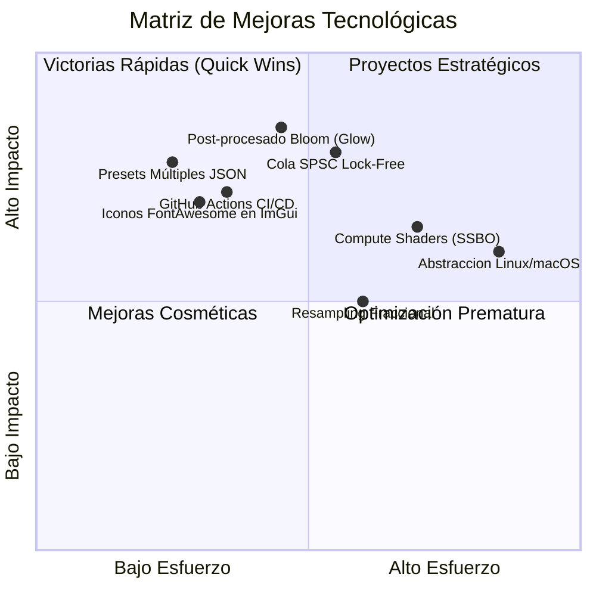
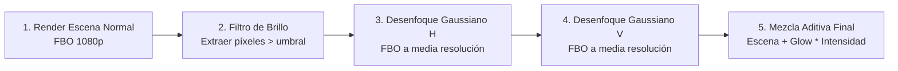

# Guía de Recomendaciones, Mejoras Arquitectónicas y Cómo Implementarlas - Audio Visualizer 2.0

Este documento reúne las mejores prácticas de la industria, recomendaciones técnicas avanzadas y guías paso a paso (*how-to*) para evolucionar **Audio Visualizer 2.0** hacia los más altos estándares de fidelidad gráfica, rendimiento de audio y ergonomía de usuario.

---

## 1. Resumen: Matriz de Priorización (Impacto vs. Esfuerzo)



---

## 2. Recomendaciones de Procesamiento de Audio y Concurrencia (DSP)

### 2.1 Sustituir Mutex por una Cola Lock-Free SPSC (Single-Producer Single-Consumer)

#### El Problema Actual
En la versión actual, el hilo de captura WASAPI toma `AudioData::mtx` para escribir en el búfer anular y notifica mediante `cv.notify_one()`. Aunque es seguro y ligero, los bloqueos de mutex conllevan cambios de contexto en el sistema operativo (*context switches*) que pueden introducir micro-variaciones de latencia (jitter) de 1 a 3 ms si Windows está bajo carga alta de CPU.

#### La Solución Recomendada
Una cola circular sin bloqueos (*Lock-Free Ring Buffer*) basada en dos índices atómicos con semántica de memoria acquire-release (`std::memory_order_acquire` y `std::memory_order_release`). El hilo de captura solo actualiza el puntero de escritura, y el hilo FFT solo lee el puntero de lectura.

#### Cómo Implementarlo:
```cpp
template <typename T, size_t Capacity>
class LockFreeSPSCQueue {
    static_assert((Capacity & (Capacity - 1)) == 0, "Capacity debe ser potencia de 2");
    std::vector<T> buffer{ Capacity };
    std::atomic<size_t> head{ 0 }; // Solo modificado por el productor (WASAPI)
    std::atomic<size_t> tail{ 0 }; // Solo modificado por el consumidor (FFT)

public:
    bool Push(const T* data, size_t count) {
        const size_t current_head = head.load(std::memory_order_relaxed);
        const size_t current_tail = tail.load(std::memory_order_acquire);
        
        // Espacio libre disponible
        const size_t free_space = Capacity - (current_head - current_tail);
        if (count > free_space) return false; // Desbordamiento controlado

        for (size_t i = 0; i < count; ++i) {
            buffer[(current_head + i) & (Capacity - 1)] = data[i];
        }

        head.store(current_head + count, std::memory_order_release);
        return true;
    }

    size_t PopLatest(T* dest, size_t count) {
        const size_t current_head = head.load(std::memory_order_acquire);
        const size_t current_tail = tail.load(std::memory_order_relaxed);
        const size_t available = current_head - current_tail;

        if (available < count) return 0;

        // Leer siempre las 'count' muestras más recientes
        const size_t start = current_head - count;
        for (size_t i = 0; i < count; ++i) {
            dest[i] = buffer[(start + i) & (Capacity - 1)];
        }

        tail.store(current_head, std::memory_order_release);
        return count;
    }
};
```
- **Beneficio**: Latencia predecible de sub-milisegundo, cero contención entre hilos y cero llamadas al kernel.

---

### 2.2 Ventanas de Análisis Alternativas: Hann vs. Blackman-Harris

#### El Problema Actual
La ventana de Hann es un estándar excelente para uso general, pero posee una atenuación de lóbulos secundarios de ~31 dB. En frecuencias graves con mucha energía (ej. bombos de 50 Hz), parte de esa energía puede "filtrarse" hacia barras adyacentes de 70-100 Hz.

#### La Solución Recomendada
Permitir conmutar en el menú de ajustes entre:
1. **Hann**: Balance ideal entre resolución en frecuencia y atenuación de ruido (ideal para rock, pop, acústico).
2. **Blackman-Harris de 4 términos**: Atenuación de lóbulos de ~92 dB (ideal para música electrónica y subgraves profundos, evitando que el bombo "ensucie" las frecuencias adyacentes).

#### Fórmula e Implementación:
$$w_{\text{BH}}[n] = a_0 - a_1 \cos\left(\frac{2\pi n}{N-1}\right) + a_2 \cos\left(\frac{4\pi n}{N-1}\right) - a_3 \cos\left(\frac{6\pi n}{N-1}\right)$$
Donde $a_0 = 0.35875$, $a_1 = 0.48829$, $a_2 = 0.14128$, $a_3 = 0.01168$.

---

## 3. Recomendaciones de Renderizado y Shaders (GPU)

### 3.1 Pipeline de Post-Procesamiento con Resplandor Neón (Bloom / Glow)

#### Por qué es una mejora crítica
Los visualizadores modernos más atractivos (*Monstercat, Tron, Cyberpunk*) destacan por un resplandor luminoso alrededor de las barras y del anillo central. Actualmente, el efecto se simula en fragment shaders individuales con funciones exponenciales. Un pipeline de Bloom con FBO permite que **cualquier geometría** emita luz ambiental cinematográfica.

#### Cómo Implementarlo:



1. **Crear Framebuffer Objects (FBO)**:
   - FBO principal de color HDR (`GL_RGBA16F`).
   - Dos FBOs auxiliares de ping-pong a un cuarto de resolución (`width/2`, `height/2`) para el desenfoque sin penalizar la GPU.
2. **Shader de Separación de Brillo (`bright_pass.frag`)**:
   ```glsl
   #version 330 core
   in vec2 v_uv;
   out vec4 FragColor;
   uniform sampler2D u_scene_tex;
   void main() {
       vec3 col = texture(u_scene_tex, v_uv).rgb;
       float brightness = dot(col, vec3(0.2126, 0.7152, 0.0722));
       if (brightness > 0.65) {
           FragColor = vec4(col, 1.0);
       } else {
           FragColor = vec4(0.0, 0.0, 0.0, 1.0);
       }
   }
   ```
3. **Desenfoque Gaussiano de 2 Pasadas (Separable)**:
   - Pasar horizontalmente y luego verticalmente con pesos gaussianos de 5 o 7 tomas (*taps*).
4. **Mezcla Aditiva**:
   - `vec3 finalColor = sceneColor + bloomColor * u_bloom_intensity;`

---

### 3.2 Compute Shaders y SSBO para Física de Partículas (OpenGL 4.3+)

#### La Idea
Elevar el contexto a OpenGL 4.3 Core para disponer de `GL_COMPUTE_SHADER`.
- En lugar de animar partículas en la CPU, instanciar **100,000 partículas** en un `GL_SHADER_STORAGE_BUFFER_OBJECT` (SSBO).
- El Compute Shader lee el buffer de magnitudes FFT directamente en la GPU y aplica fuerza centrífuga a las partículas en cada cuadro.
- **Resultado**: Efecto de nebulosa espacial o galaxia que estalla al compás del bombo a 240 FPS con 0% de uso de CPU.

---

## 4. Recomendaciones de UX/UI y Ergonomía

### 4.1 Soporte de Múltiples Presets de Usuario (Perfiles JSON)

#### La Idea
En lugar de un único objeto `"estilos"` en `config.json`, estructurar el archivo para soportar colecciones de perfiles creados por el usuario:

```json
{
  "active_preset": "Synthwave Glow",
  "presets": [
    {
      "name": "Synthwave Glow",
      "visual_mode": 1,
      "attack_ms": 10.0,
      "release_ms": 140.0,
      "base_color_rgb": [0.05, 0.80, 0.95],
      "peak_color_rgb": [1.00, 0.10, 0.60]
    },
    {
      "name": "Metal Head",
      "visual_mode": 0,
      "attack_ms": 5.0,
      "release_ms": 80.0,
      "base_color_rgb": [0.85, 0.10, 0.10],
      "peak_color_rgb": [1.00, 0.90, 0.10]
    }
  ]
}
```

#### En la UI de Dear ImGui:
- Un ComboBox que permite seleccionar el perfil activo.
- Un botón `[ + Guardar Nuevo Preset ]` que solicita un nombre en un modal `ImGui::InputText`.
- Un botón `[ Eliminar Preset ]`.

---

### 4.2 Integración de Iconos Vectoriales (FontAwesome / Lucide) en Dear ImGui

#### El Problema Actual
La UI utiliza texto como `[ Refrescar ]`, `(?)`, o `ESTADO:`. Los iconos universales aumentan la velocidad de escaneo visual y dan un acabado profesional de producto comercial.

#### Cómo Implementarlo:
1. Descargar `fa-solid-900.ttf` de FontAwesome (gratuito) o `lucide.ttf`.
2. Usar la cabecera open source `IconsFontAwesome5.h` que mapea cada icono a macros UTF-8 (`ICON_FA_SYNC`, `ICON_FA_SLIDERS_H`, `ICON_FA_PALETTE`).
3. En la inicialización:
   ```cpp
   ImGuiIO& io = ImGui::GetIO();
   io.Fonts->AddFontDefault(); // Fuente base

   static const ImWchar icons_ranges[] = { ICON_MIN_FA, ICON_MAX_FA, 0 };
   ImFontConfig icons_config;
   icons_config.MergeMode = true; // Fusionar con la fuente principal
   icons_config.PixelSnapH = true;
   io.Fonts->AddFontFromFileTTF("fonts/fa-solid-900.ttf", 14.0f, &icons_config, icons_ranges);
   ```
4. En los botones:
   ```cpp
   if (ImGui::Button(ICON_FA_SYNC " Refrescar")) { ... }
   if (ImGui::BeginTabItem(ICON_FA_PALETTE " Color y Temas")) { ... }
   ```

---

## 5. Recomendaciones de DevOps, CI/CD y Empaquetado

### 5.1 Pipeline Automatizado con GitHub Actions (`.github/workflows/build.yml`)

Para asegurar que cada cambio compile limpiamente en x64 y que los binarios estén siempre disponibles para descargar:

```yaml
name: Build & Release Audio Visualizer

on:
  push:
    branches: [ master ]
  pull_request:
    branches: [ master ]

jobs:
  build-windows:
    runs-on: windows-latest

    steps:
    - name: Checkout Código
      uses: actions/checkout@v4
      with:
        submodules: recursive

    - name: Configurar CMake
      run: cmake -B build -S . -A x64

    - name: Compilar en Modo Release
      run: cmake --build build --config Release

    - name: Empaquetar Artefacto ZIP
      run: |
        Compress-Archive -Path build/Release/* -DestinationPath audio-visualizer-windows-x64.zip

    - name: Subir Binario como Artefacto
      uses: actions/upload-artifact@v4
      with:
        name: audio-visualizer-windows-x64
        path: audio-visualizer-windows-x64.zip
```

---

## 6. Recomendaciones de Portabilidad (Soporte Futuro Linux/macOS)

Aunque el requerimiento actual se enfoca en Windows WASAPI, para mantener la arquitectura preparada para el futuro sin sobreingeniería:

1. **Definir una Interfaz de Abstracción de Audio**:
   ```cpp
   class IAudioCaptureDriver {
   public:
       virtual ~IAudioCaptureDriver() = default;
       virtual bool Initialize(AudioData& data) = 0;
       virtual void Start() = 0;
       virtual void Stop() = 0;
       virtual std::vector<AudioDeviceInfo> GetDevices() = 0;
       virtual void SetDevice(const std::string& id) = 0;
   };
   ```
2. **Implementaciones por Plataforma**:
   - `WasapiCaptureDriver` (Windows - Ya implementado).
   - `PulseAudioCaptureDriver` o `PipeWireCaptureDriver` (Linux con monitor de sink).
   - `CoreAudioCaptureDriver` (macOS).
3. Todo el código de FFTW, OpenGL 3.3, Shaders GLSL, GLFW, Dear ImGui y CMake es **100% multiplataforma de forma nativa**, por lo que solo la capa de captura cambiaría.
