# Arquitectura de la Capa de Análisis y Descomposición en Bandas - Audio Visualizer 3.0

> **Estado:** Propuesta (versión 3.0). No implementado.  
> **Alcance:** Arquitectura de la capa de análisis: estructuras de datos, hilos, texturas, configuración, presupuesto y plan por fases. La base matemática está en el documento 10.  
> **Documentos relacionados:** [10_signal_decomposition_theory.md](10_signal_decomposition_theory.md), [04_kanban_bdd.md](04_kanban_bdd.md), [07_user_manual_and_config.md](07_user_manual_and_config.md), [12_fluent_design_ui.md](12_fluent_design_ui.md)  
> **Convención:** este documento distingue entre lo *implementado* (verificable en el código de `master`) y lo *propuesto* (diseño para la versión 3.0). Toda cifra cuantitativa se deriva o se referencia; no hay estimaciones sin base.

## Índice

1. [Objetivo y principio de diseño](#1-objetivo-y-principio-de-diseño)
2. [Diagnóstico de la versión 2.0](#2-diagnóstico-de-la-versión-20)
3. [La trama de análisis](#3-la-trama-de-análisis)
4. [Definición de bandas](#4-definición-de-bandas)
5. [Flujo de datos y sincronización](#5-flujo-de-datos-y-sincronización)
6. [Representación en GPU](#6-representación-en-gpu)
7. [Dinámica por banda](#7-dinámica-por-banda)
8. [Modos de visualización nuevos](#8-modos-de-visualización-nuevos)
9. [Configuración](#9-configuración)
10. [Presupuesto de rendimiento](#10-presupuesto-de-rendimiento)
11. [Plan por fases y criterios de aceptación](#11-plan-por-fases-y-criterios-de-aceptación)
12. [Decisiones descartadas](#12-decisiones-descartadas)

## 1. Objetivo y principio de diseño

Recuperar toda la información que la transformada de Fourier extrae del audio y ponerla a disposición de cualquier renderizador, en lugar de reducirla a un solo vector de alturas de barra. El principio es la separación estricta entre análisis y presentación: el hilo de procesado produce una trama de análisis completa y autodescriptiva; los renderizadores la consumen y ninguno vuelve a tocar el audio crudo.

Esto convierte cada visualización nueva en un shader más, sin modificar el análisis, y permite que el usuario decida en cuántas bandas divide el sonido y cómo responde cada una.

## 2. Diagnóstico de la versión 2.0

| Aspecto | Estado actual | Limitación |
|---|---|---|
| Salida del procesado | Un `vector<float>` de magnitudes en dB normalizadas, con un valor por píxel de ancho | Descarta la fase, descarta la magnitud lineal y acopla el análisis al ancho de la ventana |
| Forma de onda | Últimas 1024 muestras crudas | Solo la mezcla; no hay ondas por banda |
| Dinámica | `attack_ms` y `release_ms` globales | Un bombo y un plato comparten la misma inercia |
| Bandas | Implícitas, una por píxel | No configurables ni nombrables; no hay energía por banda |
| Historial | Solo en la textura del espectrograma, ya cuantizado | No reutilizable por otros modos |
| Ventana | Hann periódica (denominador $N$), en `src/analysis/window_function.cpp` | Ya cumple la condición de la teoría, sección 4.2; sin trabajo pendiente |

## 3. La trama de análisis

Estructura producida una vez por salto ($H = 256$ muestras, unas 187 veces por segundo, en la práctica unas 100 por el periodo de WASAPI):

```cpp
struct BandDefinition {
    std::string name;      // "Sub", "Bajo", "Medios", ...
    float f_low_hz;
    float f_high_hz;
    int   bin_low;         // derivados de f_low, f_high y sample_rate
    int   bin_high;        // intervalo [bin_low, bin_high)
    float ramp_bins;       // anchura de la rampa de coseno alzado (0 = mascara binaria)
};

struct AnalysisFrame {
    uint64_t sequence;                 // contador monotono
    uint64_t sample_position;          // total_samples al final de la ventana
    int      sample_rate;
    int      fft_size;                 // N
    int      hop_size;                 // H

    // Espectro completo (N/2+1 elementos). La fase se conserva.
    std::vector<float> magnitude;      // |X[k]| normalizada: seno a escala completa = 1.0
    std::vector<float> phase;          // arg X[k] en (-pi, pi]
    std::vector<float> magnitude_db;   // 20 log10(|X[k]| + eps), sin normalizar a 0..1

    // Bandas (K elementos cada vector).
    std::vector<float> band_energy;    // sum |X[k]|^2 sobre la banda (Parseval)
    std::vector<float> band_rms;       // raiz de energia / numero de bins
    std::vector<float> band_peak_db;   // maximo de magnitude_db en la banda
    std::vector<float> band_waveform;  // K * H muestras: onda reconstruida de cada banda,
                                       // solo el tramo nuevo de H muestras (ver 5.3)

    // Globales.
    float rms;                          // de la ventana completa
    float peak;                         // |x| maximo en la ventana
    float spectral_flux;                // sum max(0, |X_m| - |X_{m-1}|)
    float spectral_centroid_hz;         // sum f_k |X[k]| / sum |X[k]|

    // Mezcla en el dominio del tiempo (para el osciloscopio y la traza suma).
    std::vector<float> mix_waveform;    // las H muestras nuevas de x[n]
};
```

Tamaño por trama con $N = 2048$, $K = 8$: espectro $3 \times 1025 \times 4 = 12{,}3$ KB; bandas $8 \times 256 \times 4 = 8{,}2$ KB; total unos 21 KB. A 187 tramas por segundo, 3,9 MB/s en memoria, sin copias adicionales gracias al intercambio por `swap`.

El vector de alturas de barra de la versión 2.0 deja de ser parte del análisis: es un renderizador (barras) que muestrea `magnitude_db` según su propio mapeo de bins a píxeles. Esto elimina la dependencia inversa actual, en la que el procesado necesita saber el ancho de la ventana.

## 4. Definición de bandas

### 4.1 Modos de partición

| Modo | Regla | Uso |
|---|---|---|
| `octaves` | $f_{b+1} = 2^{1/d} f_b$ desde `f_min` hasta `f_max`, con $d$ divisiones por octava | Musical. Con $d = 1$ y 20 a 20480 Hz salen 10 bandas |
| `linear` | Anchura constante $(f_{max} - f_{min}) / K$ | Técnico |
| `manual` | Lista explícita de cortes en Hz | Presets como el clásico de 7 bandas de los ecualizadores domésticos |
| `per_bin` | Una banda por bin de la FFT | Máxima granularidad; solo para modos que lean texturas, nunca para reconstruir ondas (teoría, sección 6.3) |

### 4.2 Preset por defecto propuesto

Siete bandas nombradas, habituales en mezcla de audio:

| Nombre | Rango (Hz) | Bins con $N = 2048$ a 48 kHz |
|---|---|---|
| Sub | 20 a 60 | 1 a 2 |
| Bajo | 60 a 250 | 3 a 10 |
| Medios bajos | 250 a 500 | 11 a 21 |
| Medios | 500 a 2000 | 22 a 85 |
| Medios altos | 2000 a 4000 | 86 a 170 |
| Presencia | 4000 a 6000 | 171 a 255 |
| Brillo | 6000 a 20000 | 256 a 853 |

La fila "Sub" ilustra el límite de la sección 5 de la teoría: con dos bins, la onda reconstruida de esa banda es una senoidal lenta modulada, no el detalle de cada golpe. Es correcto y esperable. Si el usuario quiere más detalle en graves, la opción es la resolución variable (teoría, sección 7).

### 4.3 Invariantes

- Las bandas son contiguas y particionan $[$`f_min`, `f_max`$]$: `f_high` de una es `f_low` de la siguiente.
- Con rampas, las rampas de bandas vecinas son complementarias, de modo que $\sum_b M_b[k] = 1$ en todo $k$ (teoría, teorema 4.3).
- Los bins fuera de $[$`f_min`, `f_max`$]$ se asignan a una banda implícita "resto" que no se muestra pero se suma en la traza de mezcla, para que la traza suma siga siendo exactamente la señal.
- Cambiar `sample_rate` o `fft_size` recalcula `bin_low` y `bin_high` en la siguiente trama.

## 5. Flujo de datos y sincronización

### 5.1 Hilos

Se mantienen los tres hilos de la versión 2.0. Cambia el contenido del intercambio entre procesado y render.

```mermaid
flowchart LR
    subgraph T1[Hilo de captura]
        CAP[WASAPI loopback<br/>mezcla a mono]
    end
    subgraph SD1[AudioData]
        RING[(anillo 8192<br/>total_samples)]
    end
    subgraph T2[Hilo de procesado]
        WIN[Hann periodica<br/>FFT r2c]
        MAG[magnitud, fase, dB<br/>flujo, centroide]
        BND[mascaras por banda<br/>K x IFFT + solapamiento]
        FRAME[AnalysisFrame]
    end
    subgraph SD2[AnalysisExchange]
        TRIPLE[(triple bufer<br/>sequence atomico)]
    end
    subgraph T0[Hilo principal]
        UP[subida a texturas<br/>historial circular]
        DYN[dinamica por banda<br/>ataque / caida]
        RENDER[renderizadores<br/>shaders]
    end
    CAP --> RING --> WIN --> MAG --> BND --> FRAME --> TRIPLE --> UP --> DYN --> RENDER
```



### 5.2 Intercambio por triple búfer

El `swap` bajo mutex de la versión 2.0 sigue siendo válido, pero con tramas de 21 KB conviene evitar la copia que hace el render al leer. Un triple búfer con un índice atómico permite que el productor escriba siempre en un búfer libre y el consumidor tome el último completo sin bloqueo ni copia:

- Tres `AnalysisFrame` preasignados.
- `std::atomic<int> latest` con el índice del último completo.
- El productor escribe en el índice que no es `latest` ni el que el consumidor tiene tomado, publica con `store(release)`.
- El consumidor lee `latest` con `load(acquire)` y lo marca como tomado hasta el siguiente cuadro.

Si el productor va más rápido que el consumidor (187 frente a 144 por segundo), las tramas intermedias se descartan, igual que hoy. Ninguna trama parcial es visible jamás.

### 5.3 Reconstrucción por solapamiento en el productor

La ISTFT (teoría, sección 4.1) suma tramas solapadas. Cada trama nueva aporta $N$ muestras a la salida, de las cuales las primeras $H$ quedan completas (ya han recibido las $R = N/H$ contribuciones) y el resto siguen acumulándose. El procesado mantiene por banda un acumulador circular de $N$ muestras; tras cada trama entrega en `band_waveform` las $H$ muestras completadas y desplaza el acumulador. El render concatena esos tramos en su propio historial circular para dibujar la ventana de tiempo que quiera (por ejemplo, 2048 muestras, 43 ms, o 9600 muestras, 200 ms).

Coste por trama y banda: una IFFT de $N$ y $N$ multiplicaciones y sumas. Ver sección 10.

## 6. Representación en GPU

Todos los datos se suben como texturas de un canal en coma flotante (`GL_R32F`), formato que la versión 2.0 ya usa.

| Textura | Dimensiones | Contenido | Actualización |
|---|---|---|---|
| `tex_spectrum_history` | $(N/2+1) \times T$, $T = 512$ tramas | `magnitude_db`, fila circular | Una fila por trama (`glTexSubImage2D`) |
| `tex_phase_history` | $(N/2+1) \times T$ | `phase` | Igual; opcional, solo si algún modo la usa |
| `tex_band_waveforms` | $L \times K$, $L = 4096$ muestras | Historial circular de cada onda de banda | $H$ muestras por trama y fila |
| `tex_mix_waveform` | $L \times 1$ | Historial de la mezcla | $H$ muestras por trama |
| `tex_band_state` | $K \times 4$ | Por banda: energía animada, pico, temporizador de pico, flujo | Cada cuadro, desde la dinámica de la sección 7 |
| `ubo_bands` | uniform buffer | `f_low`, `f_high`, color, ganancia por banda | Cuando cambia la configuración |

Con $T = 512$ tramas el historial cubre 2,7 s a 187 tramas por segundo. Memoria total en GPU: `tex_spectrum_history` 2,1 MB, `tex_band_waveforms` con $K = 32$: 0,5 MB. Despreciable.

Reducción de muestras a píxeles: cuando una traza de $L$ muestras se dibuja en $P < L$ píxeles, el fragment shader lee para cada columna el mínimo y el máximo de las $L/P$ muestras que le corresponden y rellena el segmento vertical entre ambos. Con $L/P$ grande conviene precomputar en CPU una textura auxiliar de mínimos y máximos por columna para no hacer $L/P$ lecturas por fragmento.

## 7. Dinámica por banda

La versión 2.0 aplica a todas las barras el mismo filtro de primer orden con constantes globales `attack_ms` y `release_ms`. En la 3.0 las constantes son vectores de $K$ elementos, editables por banda, y se aplican a la energía de banda, al pico y opcionalmente a la ganancia de la onda reconstruida:

$$e_b(t) = e_b(t - \Delta t) + \big(E_b - e_b(t-\Delta t)\big)\cdot\begin{cases} 1 - e^{-\Delta t / \tau^{\uparrow}_b} & E_b > e_b \\ 1 - e^{-\Delta t / \tau^{\downarrow}_b} & E_b \leq e_b \end{cases}$$

donde $E_b$ es la energía de banda de la trama más reciente y $\Delta t$ el tiempo real del cuadro, igual que hoy. Valores iniciales sugeridos: ataque más rápido y caída más lenta en graves (10 ms y 250 ms) para seguir el bombo con inercia; ataque y caída rápidos en agudos (5 ms y 80 ms) para el brillo de platos y consonantes.

El filtro por barra de la versión 2.0 se conserva dentro del renderizador de barras y hereda por defecto las constantes de la banda a la que pertenece cada barra.

## 8. Modos de visualización nuevos

| Modo | Fuente de datos | Descripción |
|---|---|---|
| Osciloscopio apilado | `tex_band_waveforms`, `tex_mix_waveform` | $K$ trazas, una por banda, con su color, y debajo la mezcla. La suma de las $K$ trazas es idéntica a la mezcla por el teorema 4.3 de la teoría. Opción de mostrar cada banda con su ganancia normalizada por RMS para que todas tengan tamaño comparable |
| Medidores de banda | `tex_band_state` | $K$ columnas o arcos con energía animada y marcador de pico, las etiquetas con nombre y rango |
| Lissajous entre bandas | dos filas de `tex_band_waveforms` | Traza XY de una banda contra otra, revela relaciones de fase entre grave y medio |
| Espectrograma con fase | `tex_spectrum_history`, `tex_phase_history` | Color por magnitud y matiz por derivada de fase, resalta componentes estables frente a ruido |
| Golpes | `spectral_flux` por banda | Eventos discretos que disparan destellos, expansiones radiales o cambios de paleta |

Los cuatro modos de la versión 2.0 se mantienen y pasan a leer de la trama de análisis en lugar del vector de alturas.

## 9. Configuración

Claves nuevas propuestas en `config.json`, bajo `"analisis"` y `"bandas"`, separadas de `"estilos"` para dejar claro que no son estética:

```json
{
  "analisis": {
    "fft_size": 2048,
    "hop_size": 256,
    "window": "hann",
    "history_frames": 512,
    "mask_ramp_bins": 1.5
  },
  "bandas": {
    "mode": "manual",
    "f_min": 20,
    "f_max": 20000,
    "divisions_per_octave": 1,
    "cuts_hz": [60, 250, 500, 2000, 4000, 6000],
    "names": ["Sub", "Bajo", "Medios bajos", "Medios", "Medios altos", "Presencia", "Brillo"],
    "attack_ms":  [10, 12, 12, 10, 8, 6, 5],
    "release_ms": [250, 200, 160, 140, 110, 90, 80],
    "gain": [1, 1, 1, 1, 1, 1, 1],
    "colors_rgb": [[0.6,0.1,0.8],[0.2,0.3,1.0],[0.1,0.7,0.9],[0.2,0.9,0.4],[0.9,0.9,0.2],[1.0,0.6,0.1],[1.0,0.3,0.3]]
  }
}
```

Reglas de validación: `fft_size` potencia de dos entre 512 y 16384; `hop_size` divide a `fft_size` con cociente al menos 4 (condición de la teoría, sección 4.2); `cuts_hz` estrictamente creciente dentro de $($`f_min`, `f_max`$)$; los vectores por banda tienen longitud `cuts_hz.size() + 1`, y si falta alguno se rellena con el valor global de `"estilos"`.

Todas las claves editables desde el HUD, con el mismo mecanismo de versión de configuración que la 2.0 ya usa para reconstruir las bandas en caliente.

## 10. Presupuesto de rendimiento

Objetivo: mantener el procesado por debajo del 3 % de un núcleo y el render sin caída por debajo del refresco del monitor.

| Componente | Coste por segundo | Estimación |
|---|---|---|
| FFT de análisis | $N \log_2 N \times 187$ | 4 MFLOP |
| Magnitud, fase, dB, flujo | $4 \times 1025 \times 187$ | 0,8 MFLOP (la fase con `atan2` es lo más caro; solo si algún modo la usa) |
| IFFT por banda, $K = 8$ | $8 \times N \log_2 N \times 187$ | 34 MFLOP |
| IFFT por banda, $K = 32$ | | 135 MFLOP |
| Subida a GPU | 21 KB por trama | 4 MB/s |
| Render de trazas | $K$ pases de pantalla completa o una malla de segmentos | Limitado por relleno, no por cómputo; una ventana 1080p con 8 trazas es una fracción de milisegundo en cualquier GPU discreta |

Un núcleo moderno sostiene decenas de GFLOP/s en `float` con SIMD; las cifras anteriores son del orden del 1 %. La reconstrucción de bandas solo se ejecuta para las bandas que algún modo visible necesita, así que el coste en los modos actuales es cero.

## 11. Plan por fases y criterios de aceptación

### Fase A. Trama de análisis

- Sustituir el vector de alturas por `AnalysisFrame` con magnitud, dB, RMS, pico y flujo. Ventana de Hann periódica.
- Triple búfer.
- Los cuatro modos actuales leen de la trama.
- **Criterio.** Dado audio en reproducción, cuando se comparan capturas de los cuatro modos antes y después del cambio, entonces son visualmente equivalentes y el procesado no supera el 1 % de CPU.

### Fase B. Bandas y energía

- `BandDefinition`, los cuatro modos de partición, validación, HUD.
- `band_energy`, `band_rms`, `band_peak_db`.
- Dinámica por banda de la sección 7. Medidores de banda como nuevo modo.
- **Criterio.** Dado el preset de siete bandas, cuando suena una senoidal de 100 Hz a -6 dBFS, entonces solo la banda "Bajo" muestra energía, con un error respecto al valor teórico inferior a 0,5 dB, y la suma de energías de todas las bandas iguala la energía total con error relativo menor que $10^{-4}$ (Parseval).

### Fase C. Reconstrucción y osciloscopio apilado

- IFFT enmascarada por banda con solapamiento, rampas de coseno alzado, historial circular.
- Modo osciloscopio apilado con reducción por mínimo y máximo.
- **Criterio.** Dada cualquier señal, cuando se suman numéricamente las $K$ ondas de banda y se comparan con la mezcla, entonces el error máximo es inferior a $10^{-5}$ en escala completa (teorema 4.3). Y dado un golpe de bombo, cuando se observa la traza grave, entonces el golpe aparece en el mismo cuadro que en la traza de mezcla.

### Fase D. Resolución variable (opcional)

- Pirámide de tres FFT (8192, 2048, 512) para graves, medios y agudos.
- **Criterio.** Dadas dos senoidales de 40 y 42,5 Hz simultáneas, cuando se observa el espectro grave, entonces aparecen como dos picos distinguibles; y la interfaz muestra la latencia añadida de la banda grave.

## 12. Decisiones descartadas

| Alternativa | Motivo de descarte |
|---|---|
| Reconstruir una onda por bin | Multiplica por mil el volumen sin añadir información (teoría, secciones 6.2 y 6.3) |
| Banco de filtros IIR como camino principal | Retardos de grupo distintos por banda desalinean las trazas; queda como opción secundaria (teoría, sección 8) |
| Separación de fuentes por red neuronal | Latencia de segundos y coste incompatible con 144 fps (teoría, sección 10) |
| Enviar el audio crudo a la GPU y hacer la FFT en compute shader | Requiere OpenGL 4.3, rompe la compatibilidad 3.3 Core elegida en la 2.0 y no aporta a estas escalas de cómputo |
| Mantener el vector de alturas como salida del procesado | Acopla el análisis al ancho de la ventana e impide reutilizar los datos en otros modos |
