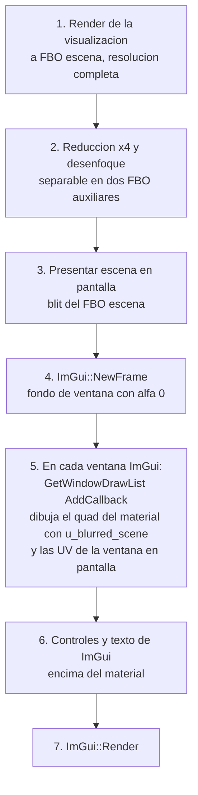

# Diseño Visual Moderno: Fluent Design, Materiales y Post-procesado - Audio Visualizer 3.0

> **Estado:** Propuesta (versión 3.0). No implementado.  
> **Alcance:** Lenguaje visual Fluent Design: materiales del sistema y propios, desenfoque, ruido, integración con Dear ImGui, movimiento, DPI, accesibilidad, compatibilidad y coste.  
> **Documentos relacionados:** [02_tech_spec.md](02_tech_spec.md), [03_ux_flows.md](03_ux_flows.md), [11_analysis_frame_architecture.md](11_analysis_frame_architecture.md), [09_recommendations_and_future_improvements.md](09_recommendations_and_future_improvements.md)  
> **Convención:** este documento distingue entre lo *implementado* (verificable en el código de `master`) y lo *propuesto* (diseño para la versión 3.0). Toda cifra cuantitativa se deriva o se referencia; no hay estimaciones sin base.

## Índice

1. [Principios de Fluent Design y su traducción a este proyecto](#1-principios-de-fluent-design-y-su-traducción-a-este-proyecto)
2. [Materiales del sistema: Mica y Acrílico](#2-materiales-del-sistema-mica-y-acrílico)
3. [Materiales propios: la receta del acrílico](#3-materiales-propios-la-receta-del-acrílico)
4. [Desenfoque gaussiano: fundamento y coste](#4-desenfoque-gaussiano-fundamento-y-coste)
5. [Ruido](#5-ruido)
6. [Integración con Dear ImGui](#6-integración-con-dear-imgui)
7. [Movimiento](#7-movimiento)
8. [Profundidad, capas y sombras](#8-profundidad-capas-y-sombras)
9. [Escala y DPI](#9-escala-y-dpi)
10. [Accesibilidad y contraste](#10-accesibilidad-y-contraste)
11. [Compatibilidad y degradación](#11-compatibilidad-y-degradación)
12. [Presupuesto de rendimiento](#12-presupuesto-de-rendimiento)
13. [Plan por fases y criterios de aceptación](#13-plan-por-fases-y-criterios-de-aceptación)
14. [Referencias](#14-referencias)

## 1. Principios de Fluent Design y su traducción a este proyecto

Microsoft define Fluent Design con cinco componentes: luz, profundidad, movimiento, material y escala. La tabla indica qué significa cada uno aquí y con qué mecanismo se consigue.

| Principio | Significado en Fluent | Traducción en el visualizador | Mecanismo |
|---|---|---|---|
| Material | Superficies translúcidas que dejan ver lo que hay detrás, con desenfoque, tinte y ruido | El panel de control flota sobre la visualización y deja intuir el movimiento debajo | Sección 3 (receta) y 6 (ImGui) |
| Profundidad | Capas ordenadas en Z, con sombras y paralaje suave | Fondo (escena), capa de material (panel), capa de contenido (texto y controles) | Sección 8 |
| Luz | Iluminación que revela la interacción (reveal, foco) | Borde luminoso al pasar el ratón por un control, resplandor del anillo radial que ilumina el panel | Sombreado en el fragment shader del panel con la posición del ratón como uniforme |
| Movimiento | Transiciones con aceleración natural, nunca lineales, de 150 a 300 ms | Apertura y cierre del panel, cambio de modo, aparición de avisos | Sección 7 |
| Escala | Layout que se adapta a DPI, tamaño de ventana y densidad | Fuentes e iconos escalados por DPI, panel con anchura relativa | Sección 9 |

Un requisito transversal: la visualización es el protagonista y el panel es una herramienta. El material del panel debe atenuar lo que hay debajo lo justo para que el texto se lea (sección 10) y no más.

## 2. Materiales del sistema: Mica y Acrílico

Windows 11 puede pintar el fondo de una ventana con un material del sistema, sin que la aplicación renderice nada. Se activa con una llamada a la API de composición del escritorio:

```cpp
#include <dwmapi.h>
#pragma comment(lib, "dwmapi.lib")

// Valores de DWM_SYSTEMBACKDROP_TYPE (Windows 11 22H2, build 22621 o superior)
// 0 = DWMSBT_AUTO, 1 = DWMSBT_NONE, 2 = DWMSBT_MAINWINDOW (Mica),
// 3 = DWMSBT_TRANSIENTWINDOW (Acrilico), 4 = DWMSBT_TABBEDWINDOW (Mica Alt)
const DWORD DWMWA_SYSTEMBACKDROP_TYPE_ = 38;
const DWORD DWMWA_USE_IMMERSIVE_DARK_MODE_ = 20;
const DWORD DWMWA_WINDOW_CORNER_PREFERENCE_ = 33;

HWND hwnd = glfwGetWin32Window(window);
BOOL dark = TRUE;
DwmSetWindowAttribute(hwnd, DWMWA_USE_IMMERSIVE_DARK_MODE_, &dark, sizeof(dark));
int backdrop = 3; // Acrilico
DwmSetWindowAttribute(hwnd, DWMWA_SYSTEMBACKDROP_TYPE_, &backdrop, sizeof(backdrop));
int corners = 2;  // DWMWCP_ROUND
DwmSetWindowAttribute(hwnd, DWMWA_WINDOW_CORNER_PREFERENCE_, &corners, sizeof(corners));
```

Condiciones para que el material del sistema sea visible:

1. La ventana debe crearse con `glfwWindowHint(GLFW_TRANSPARENT_FRAMEBUFFER, GLFW_TRUE)`.
2. Las zonas donde debe verse el material se limpian con alfa cero (`glClearColor(0, 0, 0, 0)`). Donde la aplicación pinta con alfa uno, el material queda oculto.
3. El marco debe extenderse al área cliente con `DwmExtendFrameIntoClientArea` y márgenes $-1$, o el material solo aparece en la barra de título.

Diferencias entre los dos materiales:

| Material | Qué desenfoca | Coste para la aplicación | Uso recomendado |
|---|---|---|---|
| Mica (2) | El fondo de escritorio, no las ventanas que hay detrás. Estático mientras la ventana está activa | Cero: lo compone DWM | Fondo de la ventana principal cuando se quiere integrar con el escritorio |
| Acrílico (3) | Todo lo que hay detrás de la ventana, en tiempo real | Cero para la aplicación, pero DWM consume GPU | Ventana en modo flotante sobre otras aplicaciones, la idea de un visualizador siempre visible |

Limitación importante: el material del sistema solo puede aplicarse a la ventana completa. No sirve para que el panel de control desenfoque la visualización que está dentro de la misma ventana. Para eso hace falta la sección 3.

## 3. Materiales propios: la receta del acrílico

El acrílico de Fluent es una composición de cuatro capas sobre el fondo, en este orden:

1. **Desenfoque gaussiano** del fondo, con desviación típica $\sigma$ de 20 a 30 píxeles a 100 % de escala.
2. **Mezcla por exclusión** con un gris (`#808080` aproximadamente) al 10 a 20 %, que aplana el contraste del fondo desenfocado.
3. **Tinte de color** con la opacidad del material (habitualmente entre 0,6 y 0,85 en tema oscuro).
4. **Ruido** monocromo al 2 a 4 % para romper el banding y dar textura de vidrio esmerilado.

En un fragment shader:

```glsl
#version 330 core
in vec2 v_uv;
out vec4 FragColor;
uniform sampler2D u_blurred_scene;   // escena ya desenfocada, a resolucion reducida
uniform vec4  u_tint;                // rgb y opacidad del material
uniform float u_exclusion;           // 0.1 a 0.2
uniform float u_noise_amount;        // 0.02 a 0.04
uniform vec2  u_resolution;

float hash(vec2 p) {                 // ruido blanco determinista por pixel
    return fract(sin(dot(p, vec2(12.9898, 78.233))) * 43758.5453);
}

void main() {
    vec3 bg = texture(u_blurred_scene, v_uv).rgb;
    vec3 gray = vec3(0.5);
    vec3 excl = bg + gray - 2.0 * bg * gray;             // mezcla por exclusion
    bg = mix(bg, excl, u_exclusion);
    vec3 col = mix(bg, u_tint.rgb, u_tint.a);
    float n = (hash(gl_FragCoord.xy) - 0.5) * 2.0 * u_noise_amount;
    FragColor = vec4(col + n, 1.0);
}
```

La mezcla por exclusión $E = A + B - 2AB$ tiene una propiedad útil: con $B = 0{,}5$ da $E = 0{,}5$ para cualquier $A$, es decir, empuja el fondo hacia el gris medio en la proporción `u_exclusion`. Es lo que garantiza que un fondo muy brillante o muy oscuro no rompa el contraste del texto (sección 10).

## 4. Desenfoque gaussiano: fundamento y coste

### 4.1 Núcleo

$$g_\sigma(x, y) = \frac{1}{2\pi\sigma^2}\, e^{-\frac{x^2 + y^2}{2\sigma^2}}$$

### 4.2 Separabilidad

**Enunciado.** La convolución bidimensional con $g_\sigma$ equivale a convolucionar primero cada fila con el núcleo unidimensional $g_\sigma(x) = \frac{1}{\sqrt{2\pi}\sigma} e^{-x^2/2\sigma^2}$ y después cada columna con el mismo núcleo.

**Demostración.** $g_\sigma(x, y) = g_\sigma(x)\, g_\sigma(y)$ porque $e^{-(x^2+y^2)/2\sigma^2} = e^{-x^2/2\sigma^2} e^{-y^2/2\sigma^2}$ y las constantes multiplican a $\frac{1}{2\pi\sigma^2}$. Entonces

$$(I * g)(x,y) = \sum_u \sum_v I(x-u, y-v)\, g(u)\, g(v) = \sum_v g(v) \Big[ \sum_u I(x-u, y-v)\, g(u) \Big]$$

y el corchete es la convolución horizontal evaluada en la fila $y - v$. $\blacksquare$

**Consecuencia.** Un núcleo de radio $r$ (con $r \approx 3\sigma$ para recoger el 99,7 % del peso) cuesta $(2r+1)^2$ lecturas por píxel en 2D y $2(2r+1)$ en dos pasadas separables. Con $\sigma = 24$, $r = 72$: 21 025 lecturas frente a 290. Un factor 72.

### 4.3 Reducción de resolución

Un desenfoque de $\sigma = 24$ píxeles elimina todo detalle por debajo de unas decenas de píxeles, así que puede calcularse sobre una copia a un cuarto de resolución con $\sigma' = 6$ y ampliarse después con filtrado bilineal sin diferencia visible. Reduce el coste otras 16 veces. Combinando con el muestreo bilineal entre dos texels por lectura (que promedia dos pesos del núcleo en una sola lectura), un desenfoque de calidad de acrílico sobre 1920 por 1080 cuesta:

$$\frac{1920 \times 1080}{16} \times 2 \text{ pasadas} \times 9 \text{ lecturas} \approx 2{,}3 \cdot 10^6 \text{ lecturas de textura por cuadro}$$

A 144 cuadros por segundo son 340 millones de lecturas por segundo, del orden del 1 % de la capacidad de una GPU integrada actual.

### 4.4 Alternativa: filtro dual de Kawase

Para $\sigma$ grandes, la cadena de reducciones sucesivas a la mitad con un núcleo fijo de 5 a 13 lecturas por pasada (filtro dual de Kawase, usado por los compositores de escritorio) produce un desenfoque indistinguible del gaussiano con menos lecturas todavía. Es la opción si el coste de 4.3 resultara alto en portátiles.

## 5. Ruido

El ruido del acrílico cumple dos funciones: rompe el banding que produce cuantizar un degradado suave a 8 bits, y da la sensación de textura material. Requisitos:

- Amplitud entre 0,02 y 0,04 en escala de 0 a 1. Por encima de 0,05 se percibe como suciedad.
- Determinista por píxel y estable en el tiempo. Un ruido que cambia cada cuadro parpadea y cansa. La función `hash` de la sección 3 depende solo de `gl_FragCoord`, así que es estable.
- Monocromo. El ruido de color desplaza el tinte.

Si se quisiera ruido con estructura (grano de película), se sustituye el hash por ruido de valor o de Perlin en dos octavas, con la misma amplitud.

## 6. Integración con Dear ImGui

Dear ImGui no tiene noción de material ni de desenfoque: pinta rectángulos con un color de fondo. La integración se hace en tres pasos por cuadro:



Detalles que importan:

- `ImGuiCol_WindowBg` se pone con alfa cero. El material lo pinta el callback del punto 5, no el color de ImGui.
- Las UV del quad del material se calculan a partir de `ImGui::GetWindowPos()` y `GetWindowSize()` divididas por el tamaño del framebuffer, de modo que el panel "recorta" exactamente la zona de la escena desenfocada que tiene detrás. Al arrastrar el panel, el fondo desenfocado se desplaza con él y la ilusión de vidrio se mantiene.
- El desenfoque del punto 2 solo se ejecuta si hay algún panel visible. Con el HUD oculto, el coste es cero.
- Las esquinas redondeadas del panel se aplican como máscara de distancia con signo en el mismo shader del material, con el mismo radio que `ImGuiStyle::WindowRounding`.

## 7. Movimiento

Fluent especifica curvas de aceleración, no interpolaciones lineales. Las dos que cubren casi todos los casos:

| Curva | Bezier cúbica | Uso | Duración |
|---|---|---|---|
| Deceleración | (0,1; 0,9; 0,2; 1) | Elementos que entran o aparecen | 150 a 300 ms |
| Estándar | (0,8; 0; 0,2; 1) | Elementos que cambian de posición o tamaño | 150 a 250 ms |

El proyecto ya anima las barras con constantes de tiempo y el `dt` real del cuadro. La misma disciplina se aplica a la interfaz: cada transición guarda su instante de inicio, calcula $t = \min(1, (\text{ahora} - t_0)/D)$ y evalúa la curva en $t$. Nunca se anima "por cuadro", porque el resultado dependería de los fps.

Transiciones propuestas: aparición del panel (escala de 0,96 a 1 con opacidad de 0 a 1, deceleración, 200 ms); cambio de modo visual (fundido cruzado de 150 ms entre el cuadro anterior y el nuevo, para lo que basta conservar el FBO de escena del cuadro anterior); avisos (deslizamiento de 8 píxeles con opacidad, 150 ms).

## 8. Profundidad, capas y sombras

Tres capas con orden Z fijo: escena, materiales, contenido. Entre material y escena, una sombra suave: un rectángulo redondeado desplazado de 4 a 8 píxeles hacia abajo, desenfocado con $\sigma$ de 8 a 16 y opacidad de 0,25 a 0,4. Se dibuja en el mismo callback del material antes del quad de vidrio. Dear ImGui permite además una sombra de ventana nativa a partir de la versión 1.90 con `ImGuiWindowFlags` y `ImGuiStyle::WindowShadowSize` en la rama de docking; si se usa la rama estándar, se dibuja a mano como se describe.

## 9. Escala y DPI

- `glfwWindowHint(GLFW_SCALE_TO_MONITOR, GLFW_TRUE)` y lectura de `glfwGetWindowContentScale` para escalar fuentes de ImGui (`io.FontGlobalScale` o, mejor, recargar la fuente al tamaño en píxeles correcto).
- El callback `glfwSetWindowContentScaleCallback` recarga el atlas de fuentes al mover la ventana entre monitores con distinta escala.
- Todas las medidas de la interfaz (relleno, radios, sombras, $\sigma$ del desenfoque) se expresan en píxeles a 100 % y se multiplican por la escala.

## 10. Accesibilidad y contraste

El material no puede degradar la legibilidad. La norma WCAG 2.1 exige una relación de contraste mínima de 4,5:1 entre texto y fondo (3:1 para texto grande). La relación se define con la luminancia relativa $L$:

$$C = \frac{L_{\text{claro}} + 0{,}05}{L_{\text{oscuro}} + 0{,}05}$$

Como el fondo del material es dinámico (la visualización se mueve detrás), la garantía tiene que venir del propio material: la mezcla por exclusión de la sección 3 acota el fondo hacia el gris medio y el tinte oscuro con opacidad de al menos 0,7 lo lleva por debajo de $L \approx 0{,}1$. Con texto de $L \geq 0{,}8$ (blanco al 92 %, el actual), $C \geq 0{,}85 / 0{,}15 \approx 5{,}7$. Se debe medir con la escena más brillante posible (modo cascada a ganancia máxima) y ajustar la opacidad mínima del tinte si el valor baja de 4,5.

Además: opción para desactivar transparencias y animaciones, respetando la preferencia del sistema (`SystemParametersInfo` con `SPI_GETCLIENTAREAANIMATION` y el ajuste de efectos de transparencia de Windows).

## 11. Compatibilidad y degradación

| Entorno | Material del sistema (sección 2) | Material propio (secciones 3 a 6) |
|---|---|---|
| Windows 11 22H2 o superior | Mica y Acrílico disponibles | Sí |
| Windows 11 21H2 | Solo Mica, mediante el atributo 1029 (no documentado, evitar) | Sí |
| Windows 10 | No disponible. Existe `SetWindowCompositionAttribute`, sin documentar y con parpadeos al redimensionar; no se usará | Sí, es la vía única |
| OpenGL 3.3 sin framebuffer transparente (drivers antiguos, escritorio remoto) | La ventana queda opaca; se detecta con `glfwGetWindowAttrib(window, GLFW_TRANSPARENT_FRAMEBUFFER)` | Sí |

Regla: `DwmSetWindowAttribute` devuelve un `HRESULT`; si falla, se continúa con fondo opaco sin avisar al usuario. El material propio no depende del sistema operativo y es el que da el efecto en el panel, así que es el que se implementa primero.

## 12. Presupuesto de rendimiento

| Componente | Coste por cuadro a 1920 por 1080 | Observación |
|---|---|---|
| Render de escena a FBO en lugar de a pantalla | Igual que hoy más un blit | Despreciable |
| Reducción a un cuarto | 0,13 megapíxeles escritos | Despreciable |
| Desenfoque separable, dos pasadas, 9 lecturas | 2,3 millones de lecturas | Alrededor del 1 % de una GPU integrada a 144 fps |
| Material por panel | Área del panel, unas 5 lecturas por píxel | Despreciable |
| Sombra | Área del panel ampliada | Despreciable |
| Mica o Acrílico del sistema | 0 para la aplicación | DWM lo asume |

Presupuesto total añadido: menos de 0,3 ms por cuadro en una GPU integrada. El límite de 6,9 ms por cuadro a 144 Hz no se ve comprometido.

## 13. Plan por fases y criterios de aceptación

### Fase 1. Escena a framebuffer y material propio

- FBO de escena, cadena de desenfoque, shader de material, callback de ImGui.
- **Criterio.** Dado el HUD abierto sobre el modo cascada, cuando se arrastra el panel, entonces el fondo desenfocado se desplaza con él sin discontinuidad y los fps no bajan del refresco del monitor. Y dado el texto del panel sobre la escena más brillante, cuando se mide el contraste, entonces es al menos 4,5:1.

### Fase 2. Movimiento y profundidad

- Curvas de aceleración, transiciones del panel y de cambio de modo, sombras.
- **Criterio.** Dado un cambio de modo con la tecla 2, cuando se graba la pantalla a 144 fps, entonces la transición dura 150 ms con más o menos 10 ms y no muestra ningún cuadro negro.

### Fase 3. Materiales del sistema y DPI

- Mica o Acrílico opcionales en `config.json`, esquinas redondeadas, modo oscuro del marco, escala por DPI.
- **Criterio.** Dado Windows 11 22H2 con la opción de Acrílico activa, cuando la ventana se coloca sobre otra aplicación, entonces se ve su contenido desenfocado detrás de la visualización. Y dado Windows 10, cuando se activa la misma opción, entonces la aplicación arranca con fondo opaco y sin errores.

### Fase 4. Accesibilidad

- Interruptores para transparencias y animaciones, lectura de la preferencia del sistema.
- **Criterio.** Dado Windows con los efectos de transparencia desactivados en Configuración, cuando arranca la aplicación, entonces el panel es opaco y las transiciones son instantáneas.

## 14. Referencias

- Microsoft. *Fluent Design System*: fundamentos de material, profundidad, movimiento y escala. Documentación de Windows App SDK, secciones "Materials" (Mica, Acrylic) y "Motion".
- Microsoft. `DwmSetWindowAttribute`, enumeración `DWMWINDOWATTRIBUTE` (valores 20, 33 y 38) y `DWM_SYSTEMBACKDROP_TYPE`. Documentación de la API Win32.
- Microsoft. `DwmExtendFrameIntoClientArea` y estructura `MARGINS`.
- GLFW 3.4. Guía de ventanas: `GLFW_TRANSPARENT_FRAMEBUFFER`, `GLFW_SCALE_TO_MONITOR`, `glfwGetWin32Window`.
- Kawase, M. "Frame Buffer Postprocessing Effects in DOUBLE-S.T.E.A.L". GDC 2003. Origen del filtro de Kawase; la variante dual se describe en Bavoil, L., "Bandwidth-Efficient Rendering", SIGGRAPH 2015.
- W3C. *Web Content Accessibility Guidelines 2.1*, criterio 1.4.3 (contraste mínimo) y definición de luminancia relativa.
- Cornut, O. *Dear ImGui*: `ImDrawList::AddCallback`, `ImGuiCol_WindowBg`, `ImGuiStyle`.
