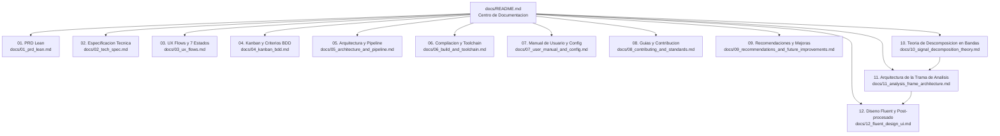

# Índice de Documentación del Proyecto - Audio Visualizer 2.0

Índice de la documentación técnica y de diseño del proyecto. Cubre la visión de producto, la especificación técnica, el fundamento matemático del análisis de señal, la guía de compilación, el manual de usuario, los estándares de contribución y las propuestas de evolución hacia la versión 3.0.

## Convenciones

- Cada documento declara en su cabecera un **Estado**: *Implementado* (describe código presente en `master`), *Propuesta* (diseño para la versión 3.0, no implementado) o *Mixto* (indica sección a sección).
- Las afirmaciones cuantitativas (latencias, volúmenes de datos, costes) se derivan en el propio documento o remiten a la derivación en [10_signal_decomposition_theory.md](10_signal_decomposition_theory.md).
- Los diagramas están en Mermaid y se renderizan en GitHub. No se usan emojis ni iconografía decorativa.
- Las fórmulas usan notación LaTeX entre `$$`.

---

## Mapa de Documentos

---

## Descripción de los Documentos

### 1. [01_prd_lean.md - PRD Lean (Product Requirements)](01_prd_lean.md)
- **Objetivo**: Define la visión de producto de Audio Visualizer 2.0.
- **Contenido**: Matriz In-Scope vs. Out-of-Scope (filtro anti-sobreingeniería), requerimientos funcionales (RF-01 a RF-07), requerimientos no funcionales (latencia, eficiencia de CPU/GPU, tolerancia a desconexiones) y métricas de éxito.

### 2. [02_tech_spec.md - Especificación Técnica](02_tech_spec.md)
- **Objetivo**: Define la ingeniería de software y decisiones de diseño.
- **Contenido**: Matriz *Build vs. Adopt*, diagrama de arquitectura de los 3 hilos concurrentes, inicialización de Modern OpenGL 3.3 Core Profile, integración de Dear ImGui y modelo de datos COM para WASAPI.

### 3. [03_ux_flows.md - Matriz de UX Flows y 7 Estados del Sistema](03_ux_flows.md)
- **Objetivo**: Modela el comportamiento de la interfaz y la experiencia del usuario.
- **Contenido**: Diagrama de estados (Carga, Silencio, Reproducción, Interacción HUD, Cambio de Dispositivo, Error/Desconexión y Cierre Limpio) y asignación ergonómica de atajos de teclado.

### 4. [04_kanban_bdd.md - Plan Ágil, Kanban y Criterios BDD](04_kanban_bdd.md)
- **Objetivo**: Estructura de historias de usuario y criterios de aceptación.
- **Contenido**: Definición de Preparado (DoR), Definición de Hecho (DoD) y desglose de las 4 épicas con escenarios formales en formato *Given-When-Then*.

### 5. [05_architecture_and_pipeline.md - Arquitectura y Pipeline Matemático](05_architecture_and_pipeline.md)
- **Objetivo**: Explicación matemática profunda del procesamiento de señal de audio.
- **Contenido**: Deducción de fórmulas de enventanado de Hann con normalización energética, FFT r2c (1025 bins), mapeo lineal y logarítmico por octavas, interpolación sub-bin, conversión a dBFS, filtros IIR independientes de FPS, física de *Peak-Hold* y shaders GLSL.

### 6. [06_build_and_toolchain.md - Guía de Compilación, Toolchain y Despliegue](06_build_and_toolchain.md)
- **Objetivo**: Manual técnico para compilar y empaquetar el proyecto.
- **Contenido**: Instrucciones para CMake CLI, Ninja, Visual Studio 2022/2026, VS Code, detalle del paso *Post-Build* automatizado y tabla de solución a errores frecuentes de compilación y enlaces DLL.

### 7. [07_user_manual_and_config.md - Manual de Usuario y Referencia de Configuración](07_user_manual_and_config.md)
- **Objetivo**: Guía de referencia para el usuario final y operadores.
- **Contenido**: Controles de teclado, guía visual del panel interactivo Dear ImGui, tabla completa de todas las claves de `config.json` (rangos, tipos y valores por defecto) y telemetría en la barra de título.

### 8. [08_contributing_and_standards.md - Guía de Contribución y Estándares](08_contributing_and_standards.md)
- **Objetivo**: Manual para desarrolladores que deseen extender o colaborar en el proyecto.
- **Contenido**: Estándares de código C++17, directrices de concurrencia y RAII, tutorial paso a paso con código para agregar un nuevo modo de visualización y checklist de Definition of Done para Pull Requests.

### 9. [09_recommendations_and_future_improvements.md - Guía de Recomendaciones y Mejoras](09_recommendations_and_future_improvements.md)
- **Objetivo**: Propuestas de ingeniería avanzada, optimizaciones y arquitectura futura.
- **Contenido**: Matriz de priorización (Esfuerzo vs. Impacto), cola SPSC Lock-Free con código C++, ventanas de análisis (Hann vs. Blackman-Harris), post-procesado con Bloom (resplandor neón), Compute Shaders y SSBO para 100k partículas a 240 FPS, presets múltiples de usuario en JSON, iconografía con FontAwesome, pipeline de CI/CD con GitHub Actions y diseño de abstracción multiplataforma para Linux/macOS.

### 10. [10_signal_decomposition_theory.md - Fundamentos Matemáticos de la Descomposición en Bandas](10_signal_decomposition_theory.md)
- **Estado**: Propuesta (versión 3.0).
- **Objetivo**: Demostrar con rigor si una pista puede separarse en las ondas de cada rango, con qué fórmulas, cuánta información produce y qué límites físicos tiene.
- **Contenido**: Teorema de inversión de la DFT, Parseval, STFT, condición de solapamiento constante y reconstrucción perfecta, teorema de la suma de bandas, principio de incertidumbre de Gabor con demostración, teorema de conservación de la información, volúmenes de datos para los parámetros del proyecto, transformada Q constante, bancos de filtros, consecuencias y riesgos de implementarlo.

### 11. [11_analysis_frame_architecture.md - Arquitectura de la Capa de Análisis](11_analysis_frame_architecture.md)
- **Estado**: Propuesta (versión 3.0).
- **Objetivo**: Convertir la teoría del documento 10 en estructuras de datos, hilos, texturas, configuración y plan por fases.
- **Contenido**: `AnalysisFrame`, definición y validación de bandas, triple búfer, reconstrucción por solapamiento, texturas de GPU, dinámica por banda, modos nuevos (osciloscopio apilado, medidores, Lissajous), esquema de `config.json`, presupuesto de rendimiento y criterios de aceptación.

### 12. [12_fluent_design_ui.md - Diseño Fluent, Materiales y Post-procesado](12_fluent_design_ui.md)
- **Estado**: Propuesta (versión 3.0).
- **Objetivo**: Llevar la ventana y el panel al lenguaje visual de Windows 11 con fundamentos verificables.
- **Contenido**: Principios de Fluent, Mica y Acrílico mediante `DwmSetWindowAttribute`, receta del acrílico propio, separabilidad del desenfoque gaussiano con demostración y coste, ruido, integración con Dear ImGui, curvas de movimiento, profundidad, DPI, contraste WCAG, compatibilidad Windows 10/11 y plan por fases.

## Estado de la documentación

| Documento | Estado | Versión que describe |
|---|---|---|
| 01 PRD | Mixto: 2.0 implementada, hoja de ruta 3.0 propuesta | 2.0 y 3.0 |
| 02 Especificación técnica | Mixto | 2.0 y 3.0 |
| 03 UX Flows | Mixto | 2.0 y 3.0 |
| 04 Kanban y BDD | Épicas 1 a 7 completadas | 2.0 y 3.0 |
| 05 Arquitectura y pipeline | Implementado, con nota sobre la ventana periódica | 2.0 |
| 06 Compilación | Implementado | 2.0 |
| 07 Manual de usuario | Implementado, con sección de funciones previstas | 2.0 |
| 08 Contribución | Implementado | 2.0 |
| 09 Recomendaciones | Propuesta | 3.0 |
| 10 Teoría de descomposición | Propuesta | 3.0 |
| 11 Arquitectura de análisis | Mixto: fases A, B y C implementadas, D propuesta | 3.0 |
| 12 Diseño Fluent | Mixto: fases 1 a 4 implementadas salvo detalles anotados | 3.0 |
